---
output:
  pdf_document: default
  html_document: default
---

# An Overview of Data literacy

In modern society, we frequently see the following types of statements in the media:

-   Momentum Chief Executive, Jeanette Marais, said while 80% of the [withdrawal requests from the two-pot retirement system] are from people between 30 and 49 years old, there was concern over requests from the 50-59 age group, which made up 16% of the total. (Reuters, 27 September 2024)

-   Despite the ever presence of sunshine and wind, only 8% of South Africa’s power comes from renewables compared to a global average of 29%. (IOL.co.za, 11 December 2023)

-   BHP Billiton, the Australian-based diversified global miner, says it expects global electricity consumption for data centers to rise from around 2% of total demand today, to 9% by 2050, with copper demand in data centers increasing six-fold by then. (Mining.com, 30 September 2024)

-   According to StatsSA’s latest report, motor trade sales for March 2024 (measured in real terms by constant 2019 prices) decreased by 10.4% year-on-year, 7% month-on-month, and 2.9% quarter-on-quarter. (businesstech.co.za, 16 May 2024)

-   Unsurprisingly, a trial found that people with heart disease who were obese or overweight reduced their risk of having a severe cardiovascular event — including death, stroke or heart attack — by 20% when they took semaglutide. (Nature.com, 25 September 2024).

-   Released this week, the sixth South African HIV prevalence, incidence, and behaviour Survey (SABSSM VI) found a 7.4% HIV prevalence rate in the province [Western Cape] for 2022, down from 8.6% in 2017. (Mail & Guardian, 29 September 2024)

    The numerical facts in the preceding statements – 80%, 16%, 8%, 29%, 2%, 9%, 10.4%, 7%, 2.9%, 20%, 7.4% and 8.6% - are referred to as **statistics or statistical information**. This type of information can help us understand the trends in economics, business, health and employment and thus enable us to make more informed decisions. Statistical information is **data** that has been recorded, classified, organized, related, or interpreted within a framework so that meaning emerges[^1]. Thus, an essential skill towards effectively making use of statistical information is data literacy. In this Chapter, we give an overview of data literacy, including key data literacy skills that will be covered more broadly in the coming chapters. Thus, this chapter lays the foundation for the rest of the book.

[^1]: <https://www150.statcan.gc.ca/n1/edu/power-pouvoir/ch1/definitions/5214853-eng.htm>[ ](https://www.media.mit.edu/publications/designing-tools-and-activities-for-data-literacy-learners/)

## Introduction {#sec1-1}

In modern society, **data** is everywhere. It is collected when we

-   make a purchase online (such as Takealot);

-   access a learning management system (such as ClickUP);

-   click an advertisement;

-   like or comment on someone’s social media post;

-   stream music or movies online (using platforms such as Spotify and Netflix);

-   review our experience with a product or service online (such as our stay at an Airbnb); and

-   engage in physical activity and even while we are sleeping! (when we are wearing a fitness tracker such as a Fitbit or Garmin).

This implies that data has now become more widely accessible to organizations as well as ordinary individuals. Using this **data**, organizations (and individuals) can make more data-driven decisions with **statistics** instead of intuition. This often leads to increased performance and efficiency, especially when compared to less data-driven approaches. However, access to data on its own isn’t enough to ensure organizational success. The users of this data, such as the employees in an organization, have to understand and know how to leverage the data and this requires that they have the necessary data literacy skills.

### Definition

Bhargava and D’Ignazio (2015), define data literacy as the ability to read, work with, analyze and argue with data[^2]. Reading the data involves understanding the data and being able to interpret it. Working with data involves creating, acquiring and managing the data. Analyzing the data involves filtering, sorting and aggregation of the data. Arguing with the data means using the data to communicate.

[^2]: <https://www.media.mit.edu/publications/designing-tools-and-activities-for-data-literacy-learners/>

In this book, we adopt an expanded form of the above definition of *data literacy*. We define data literacy as the ability to [manage]{.underline}, [understand]{.underline}, [explore]{.underline}, [analyze]{.underline}, [interpret]{.underline} and [communicate]{.underline} with data in a meaningful way. Data literacy does not require an individual to be an expert but to show an understanding of the basic data fundamentals like data sources, data types, measurement scales, types of analysis, data cleaning, data analysis tools (such as Excel)[^3], concepts that will be explored in more detail in this book.  

[^3]: <https://online.hbs.edu/blog/post/data-literacy>

### The importance of being data literate in modern society

In modern society, data plays a pivotal role for the proper functioning of governments, businesses, households and individuals. Being data literate: (1) can lead to timely response to socio-economic or health related issues, (2) it can create sustained economic value, (3) it can assist with making informed decisions, (4) it can improve communication and (5) lead to professional or career advancement. In this section, we briefly discuss the benefits of being data literate for each of these various stakeholders.

-   Governments

Information from a population census can assist a government official or department to efficiently allocate government resources by, for instance, making sure that there is an equal distribution of services such as health and education.

-   Businesses

Information from a marketing survey can assist a business to reduce its costs, improve its operational efficiency into operational excellence, improve its competitive advantage and market positioning by, for instance, understanding the trends among its customer base.

-   Households

Statistical information on the annual government budget can assist households adjust savings strategies based on changes in social welfare; identify job opportunities based on the allocation of public funds to sectors such as construction and make informed decisions through civic participation and democratic engagement.  

-   Individuals

Statistical information from a health survey or smart watch can assist an individual to improve their health and well-being; In modern society, misinformation spreads faster and widely often resulting in inaccurate decision-making. A data-literate public is more important today in order to anticipate and prevent the negative consequences of misinformation.

### Data Literacy Skills

The essential skills needed in order to be data literate can be divided according to the definition of data literacy as [managing]{.underline}, [exploring]{.underline}, [analyzing]{.underline}, [understanding]{.underline}, [interpreting]{.underline} and [communicating]{.underline} with data. The first three skills are more technical and will be explained in the following chapters. The last three skills are more practical and will be demonstrated in the following section.

### Data Literacy in Practice

#### Being able to interpret or understand and use the information contained in a chart or graph.

1.  The figure below (obtained from the 2022 *South African National HIV Prevalence, Incidence, Behaviour and Communication Survey (SABSSM VI)*[^4]) shows a map of South Africa (SA) as a **heatmap**[^5]. For each province, the map displays the HIV prevalence, which is the percentage of the population in the province that are HIV positive.

    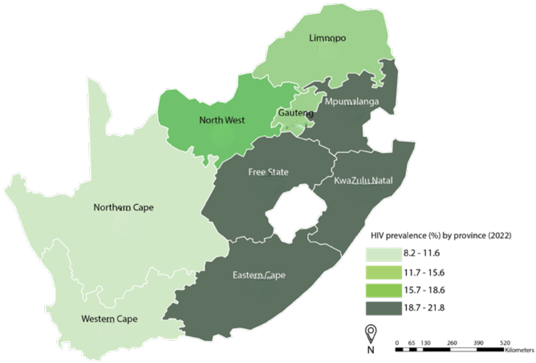{#fig1 width="500"}

[^4]: <https://sahivsoc.org/Files/SABSSMVI-SUMMARY-SHEET-2023.pdf>

[^5]: A heatmap is a two-dimensional visual representation of data using colors, where the colors all represent different values (<https://www.investopedia.com/terms/h/heatmap.asp>)

From Figure \@ref(fig1), we can see that, in 2022, the Western Cape and Northern Cape had the lowest HIV prevalence (8.2 – 11.6%).

2.  The figure below (Figure \@ref(fig2) shows a map (from an article in the September 30, 2024 issue of the *Wall Street Journal*) of the United States of America (USA) as a heatmap. For each state of the USA, the map displays the share of the total power consumed by data centers in 2023. The lighter the section on the map, the less the share of the power consumed by data centers.

    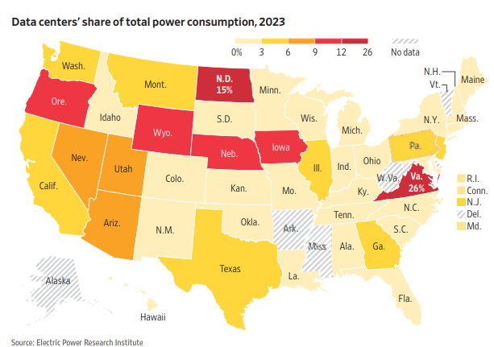{#fig2 width="500"}

    From Figure \@ref(fig2), we can see that in the state of Michigan (Mich.), for instance, data centers consume a small share (0 – 3%) of the total power consumed by the state. Whereas, in the state of Virginia (Va.) data centers consume a large share (26%) of the total power consumed in the state.

#### Being able to contextualize a number given in the media:

1.  The following is an extract from an article in the Financial Times UK[^6]

    {width="500"}

    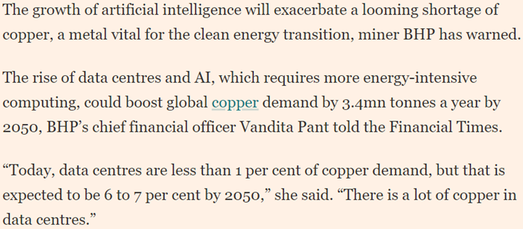{width="500"}

[^6]: <https://www.ft.com/content/da407b47-4133-470a-9574-508cee43e107>

The article talks about the growth in future copper demand from data centers as a result of Artificial Intelligence (AI). Data centers are now being used to run AI models and this process is energy intensive. Copper is used in various aspects of a data center[^7]. The growth in data centers means the growth in copper demand. Today, of all the things copper is used for in the world, data centers account for less than 1%. This number can grow to 6% or 7% by 2050 as a result of an increase of an additional 3.4 million tonnes of global copper demand.

[^7]: <https://www.visualcapitalist.com/sp/copper-the-critical-mineral-powering-data-centers/>

**Possible implications of the above statistics**: Increased job growth in the copper value chain and construction of data centers; Increased demand for AI and data center expertise; Increased demand for mining engineers with expertise in copper mining.

#### Recognising and being able to identify and avoid wrong interpretations of statistical information in the media.

1.  Consider the following extract of an article from the Business Day[^8]

    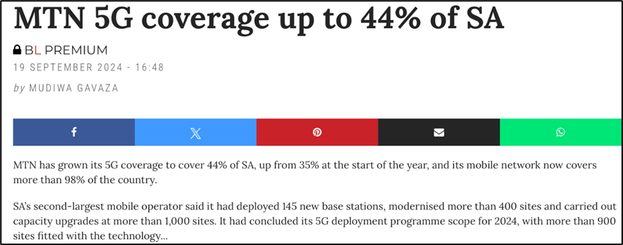{width="500"}

    How can we interpret the statistical information of 44% and what are its implications?

    **What it means**:

    44% of the total land area in South Africa has access to MTN’s 5G network signal.

    **What it [doesn’t]{.underline} mean**:

    44% of South Africans use MTN’s 5G mobile network.

[^8]: <https://www.businesslive.co.za/bd/companies/telecoms-and-technology/2024-09-19-mtn-5g-coverage-up-to-44-of-sa/#:~:text=Mobile%20operator%20concludes%20deployment%20scope,sites%20fitted%20with%20the%20technology&text=MTN%20has%20grown%20its%205G,than%2098%25%20of%20the%20country>

<!-- -->

2.  The United States’ (US) Center for Disease Control (CDC) reported that 99% of the monkeypox cases in the US occurred in men.

    **This means that:**

    Of all the reported monkeypox cases in the US, 99% of them were men.

    **It doesn’t mean that**

    All the monkeypox cases in the US are men. Thus, falsely, implying that men are more likely to get

    monkeypox (99% chance!).

### Exercises to Section 1.1

**Question 1**

What is data literacy?

**Question 2**

In each of the following scenarios, identify the statistical information:

a.  A recent poll showed that 30% of South African wealth is held by the top 1% of the wealthy individuals in the country.

b.  An environmental survey revealed that females were more environmentally conscious than males.

c.  A health study showed that people with nausea are more likely to have headaches.

d.  In a retirement planning survey, the majority of people who responded were under the age of 35.

**Question 3**

Answer the following as True or False.

a.  Data literacy is only useful to data analysts, statisticians and data scientists.

b.  It is not necessary to have an advanced knowledge in Statistics in order to be data literate.

c.  One of the skills of data literacy is the ability to argue with data.

d.  Data literacy can improve my communication skills.

**Question 4**

Answer the following questions based on Figure \@ref(fig1).

a.  What is the HIV prevalence rate for the North West province?

b.  Which of the nine provinces have the largest HIV prevalence?

c.  Which one of the following provinces has the highest HIV prevalence?

    i.  North West

    ii. Limpopo

    iii. Gauteng

d.  How many coastal provinces have the largest HIV prevalence (18.7 – 21.8%) and how many inland provinces have the largest HIV prevalence?

**Question 5**

Answer the following questions based on Figure \@ref(fig2).

a.  What share of the total power consumption in the state of Washington (Wash.) is used by data centers?

b.  Which of the following states has the largest share of its total power consumed by data centers?

    i.  Texas

    ii. Nebraska (Neb.)

**Question 6**

Consider the following figures (from the May 6, 2024 issue of *Barrons’ Magazine*) which summarizes the responses by professional investment managers on their outlook on: (***left figure***) public USA companies (Bullish means they have a positive outlook, bearish means they have a negative outlook and neutral means they are neither positive nor negative.) and (***right figure***) which global public equity market they think will perform the best.


a.  What can you say about the outlook of the majority of managers on USA public companies?

b.  Which global public equity market is the least favored?

c.  Something is wrong with these figures, can you identify it?

**Question 7**

For each of the following statements, state whether or not the interpretation of the statement is accurate. If not, motivate your answer.

a.  Of all the people born in Gauteng, 25% of them speak Sotho. Therefore, for anyone who speaks Sotho, there is a 25% chance/probability that they were born in Gauteng.

b.  The potato yield in the Limpopo province was found to be positively correlated with the coal production in the Mpumalanga province. Therefore, high potato yields lead to increases in coal production.  

c.  About 75% of the South African population has access to the internet. In other words, this implies that 3 in 4 South African citizens have some form of access to the internet.

## Data

### What is data?

Data are the raw facts and figures, about objects or events, that are collected, analyzed and summarized for presentation and interpretation in order to make informed decisions. Data typically arises as a result of a **study**. For instance, suppose the South African Reserve Bank (SARB) wants to forecast inflation in the next 12 months (the study). They will collect data about the inflation rate in the previous years and other factors influencing inflation. All the data collected by the SARB is referred to as a **data set**.

Table 1 gives a data set containing information about the 9 provinces of South Africa. The data was obtained from the 2022 South African census. The South African census is conducted every 10 years. A census provides information on the demographic, socioeconomic and geographic characteristics of the entire population, as well as household characteristics.

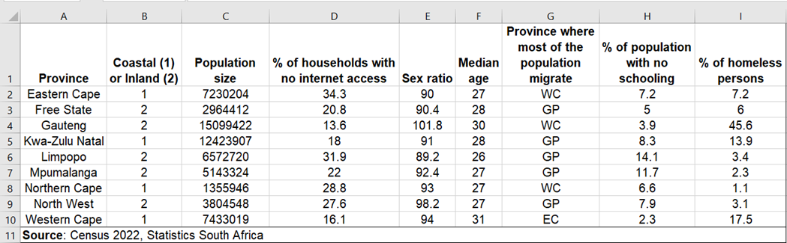

### Properties of a data set

Any data set has three essential properties, namely

#### Elements

These are the entities or objects on which the data are collected. Each of the nine provinces in Table 1 are the elements of the data.

#### Variables

These are the characteristics of interest about the elements. The data set in Table 1 has eight variables:

**Coastal or Inland**: The province’s area of location in South Africa; It can be either coastal or inland.

**Population size**: The number of people in a province.

**% of households with no internet access**: The number of households that have no access to the internet in a province as a percentage of the total population in a province.

**Sex ratio**: The number of males for every 100 females in a province. A value above 100 indicates that there are more males than females.

**Median age**

**Province where most of the population migrate**: A province in South Africa where most of the population in another province migrate to.

**% of population with no schooling**: The number of persons in a province with no formal schooling as a percentage of the total number of persons in the province.

**% of homeless persons**: The number of homeless persons in a province as a percentage of the total number of homeless persons in South Africa.

#### Observations

These are the sets of measurements obtained from each element. From Table 1, the first element (Eastern Cape) has the following measurements:

|     |         |        |     |     |     |     |     |
|-----|---------|--------|-----|-----|-----|-----|-----|
| 1   | 7230204 | 34.390 | 90  | 27  | WC  | 7.2 | 7.2 |

The second element (Free State) has the following measurements:

|     |         |      |      |     |     |     |     |
|-----|---------|------|------|-----|-----|-----|-----|
| 2   | 2964412 | 20.8 | 90.4 | 28  | GP  | 5   | 6   |

and so on. The data set with 9 elements has 9 observations.

### Observational and experimental data

Data can come from an observational study or an experimental study. **Observational data** are records of what is actually taking place in a particular situation. The data in Table 1 are an example of observational data. As another example of observational data, a bank might observe client visits at one of their branches to collect data on variables such as the length of time a typical client spends at the branch, the number of clients visiting the branch on a given day (e.g. Monday or last day of the month), the age of the clients and so on. Statistical analysis of this data may, for instance, help bank management decide whether or not to close the branch in order to reduce operational costs.

**Experimental data** is data that is obtained under controlled conditions. It is typically used to test a hypothetical statement. For instance, suppose a pharmaceutical company would like to test whether a new drug they developed is effective for weight loss. To obtain the data, researchers select a sample of individuals. The individuals are instructed to follow the same diet. One group (treatment group) of individuals is given a dose of the new drug and another group (control group) is not given the new drug. After two months, we collect data on the weight of individuals in each group and compare it with the weight data collected before the experiment. Statistical analysis of the data can help determine whether the average weight loss of the treatment group is significantly greater than that of the control group. 

### Cross-sectional and time-series data

For appropriate analysis, interpretation and communication with the collected data, a distinction must be made between **cross-sectional data** and **time series data**. Cross-sectional data are data collected at the same point in time about two or more elements. The data in Table 1 are cross-sectional because they describe eight variables about the nine provinces (elements) at the same point in time (2022). Time series data are data collected over several time periods. For instance, the figure below shows the estimated Life Expectancy at birth in South Africa for the period 2002 to 2024. Time series plots, such as the figure below, are very useful in understanding what happened in the past, identifying whether there are any trends over time and, often, forecast future values of the time series.

A time series plot is typically easy to understand and interpret. For example, from the figure, we can see that life expectancy at birth declined between 2002 and 2006. Incidentally, this was a period of increasing HIV prevalence and lack of awareness and information about prevention measures. However, due to increased awareness of HIV, expansion programmes to prevent mother-to-child transmission coupled with access to ARVs, life expectancy at birth increased from 2006 before declining in 2020 due to COVID-19. 

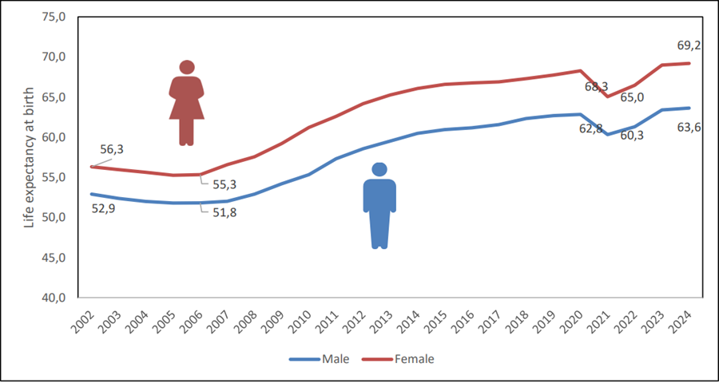{width="500"}

### Population and sample

Typically, the elements in a study consist of a large number of objects or events. For instance, suppose an accounting firm, such as KPMG, wants to determine whether the amount of accounts receivable reflected on a client’s financial statement fairly represents the actual amount of accounts receivable. Usually large industrial or manufacturing businesses, such as Bidvest Group, will have a large number of accounts receivables which will make reviewing and validating every account too costly and time-consuming. As a common practice, the audit staff selects a subset of all the accounts. This subset of accounts is known as a **sample** and all of the accounts receivable are known as a **population**. The process of collecting the data is called **sampling**.

Note that, although the elements of the data in Table 1 are the provinces, the data itself was collected from individuals from the population of South Africa. Therefore, the elements in a census survey or study are a population.

### Exercises to Section 1.2

**Question 1**

What is a data set?

**Question 2**

Name the properties of a data set.

**Question 3**

In 2023, FNB commissioned a retirement survey to find out how prepared South African consumers were for retirement. Is the data obtained from the survey respondents experimental or observational?

**Question 4**

Suppose a study is conducted to find out whether vaping (or e-cigarette smoking) is less harmful compared to tobacco smoking. Is the data obtained from the study experimental or observational?

**Question 5**

The figure below gives a bar chart showing the annual revenue of Shoprite over a ten-year period from 2014 to 2023 (The data were obtained from the annual financial statements of Shoprite[^9] and the graph was plotted using Excel).

[^9]: <https://www.shopriteholdings.co.za/shareholders-investors/financial-results-archive.html?p=1>

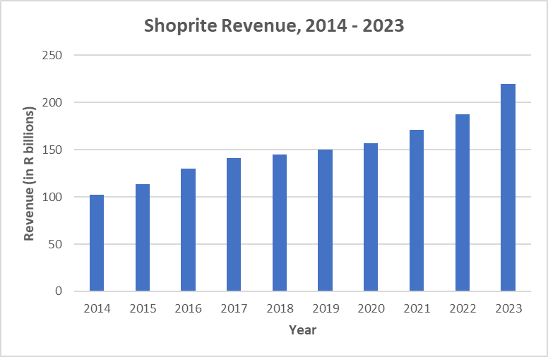{width="500"}

a\. What is the variable of interest?

b\. Are the data cross-sectional or time-series?

c\. What can you say about the trend in Shoprite’s revenue overtime?

**Question 6**

The figure below shows the quarterly FNB/BER Consumer Confidence Index for the period 2014, 1^st^ quarter, to 2024, 2^nd^ quarter[^10]. The index measures confidence among South African consumers based on their outlook on the economy and their household financial position. A higher value indicates high confidence[^11].

[^10]: <https://www.fnb.co.za/blog/investments/articles/EconomicsWeekly-20240913/?blog=investments&category=Economics&articleName=EconomicsWeekly-20240913>

[^11]: <https://www.ber.ac.za/Documents/Index/FNBBER-Consumer-Confidence-Index>

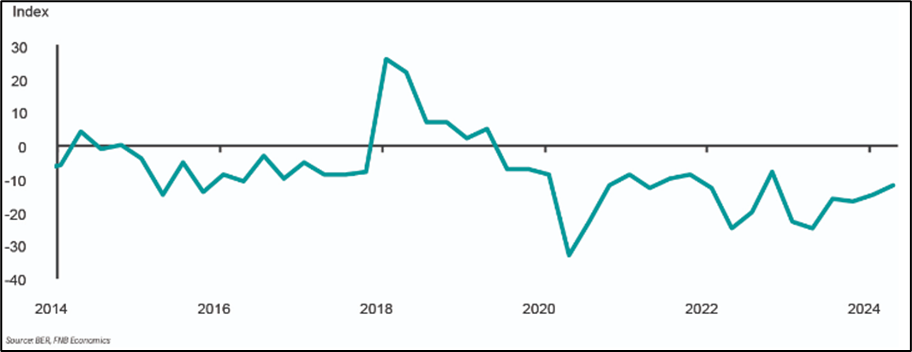{width="600"}

a.  Are the data cross-sectional or time-series?

b.  Comment on the confidence of the South African consumer over time.

\
**Question 7**

The South African Bureau of Economic Research collects data from South African adults living in predominantly urban areas to measure consumer confidence in South Africa. Survey respondents are asked about

-   their expectation about the performance of the economy;

-   their expectation about the financial position of households;

-   their rating of the present time to buy durable goods (e.g. electronic appliances).

    a.  What is the population being studied?

    b.  Is surveying mostly people in the urban areas a good way to get a good picture of consumer confidence in a country like South Africa?

**Question 8**

The 2024 Annual FNB Retirement survey collected data from a sample of 1072 South African consumers to, amongst other things, uncover their preparedness for retirement. Almost half of the respondents indicated that they do not have a retirement plan in place and 20% of the respondents indicated an annual income of more than R 850 000.

a.  What is the population of interest in this survey?

b.  Is the data collected from the survey observational or experimental?

c.  Does this survey involve cross-sectional data or time-series data?

d.  Describe any useful insights for FNB that can be obtained from the collected data.

## Data Management - Foundations and Concepts {#sec1-3}

Data management is the practice of collecting, organizing, preparing, protecting and storing data so that it can be used efficiently, securely and cost-effectively in the decision-making process. In modern society, data of different types is generated in large volumes from a variety of sources at an unprecedented speed, thus a robust data management solution is important to extract meaningful and enduring value from the data. Over and above the latter, data management is important to facilitate ease of data migration and transformation and also for regulatory compliance.

### Data management process

The data management process is made up of the following components:

-   **Data collection** is the process of gathering the necessary data from the various data sources about the variables of interest for a particular study. This process typically involves a process referred to as sampling (see Chapter \@ref(ch3)).

-   **Data organization** involves integrating different types of data, such as structured and unstructured data (see Section \@ref(sec1-8)). This process is also referred to as data warehousing.

-   **Data preparation** involves cleaning and transforming raw data into a form that is suitable for further processing and analysis. This process is important for identifying and removing errors and duplicates in the data and also filling in missing data. This increases the accuracy and quality of the data. Data preparation is also known as data wrangling (see Chapter \@ref(ch2)).

-   **Data governance** involves, amongst others, the processes and practices used to ensure data protection, security and privacy. **Data protection** includes safeguarding the data and restoring important information in the event of say, a data breach. **Data security** refers to safeguarding the data against theft, corruption and unauthorized access. **Data privacy** refers to safeguarding the collection, use and disclosure of personal and sensitive data to comply with policy and regulation such as the Protection of Personal Information Act (POPIA) of South Africa.

-   **Data storage** involves the retention of the data for future access. In modern society, data is usually stored in a digital format using an SQL database or a spreadsheet. The data files are kept on a personal computer or, in the case of large volumes of data (so-called Big Data), on servers, also known as cloud storage.

### The benefits of data management in modern society

At its core, the benefits of an effective data management system include:

-   **Availability and visibility** – effective data management increases the visibility of the data by making it easily accessible. This in turn leads to high frequency data-driven decision-making.

-   **Reliability** – a good data management system leads to accurate decision-making by making sure that the data is reliable and up to date.    

-   **Security** – a good data management system protects the data against loss and ransom-ware type data breaches. Moreover, it ensures that the data are used within the bounds of policy and regulation in an ethical manner.

-   **Scalability** – a good data management system can allow repeatable data queries that build upon each other and thus keep the data up to date. Moreover, this mitigates inconsistencies and duplications of queries.

### The challenges of data management in modern society

As is the case with any useful strategy, there are challenges towards effective data management. These includes, among others,

-   The size (or volume) of the data collected

    As mentioned in Section \@ref(sec1-1), data is everywhere. Given the size of the data generated today, traditional storage devices with storage capacity of up to gigabytes (GB) are no longer enough. We need data storage infrastructure with capacity up to terabytes (TB: \~1000 GB) and petabytes (PB: \~1000 TB).

-   The speed (or velocity) at which the data is generated

    Since data is collected at every second of every minute, we need sophisticated infrastructure to quickly effect the changes and keep the data up-to-date for future analysis.

-   The variety (or integration) of the data

    Data can come from multiple sources (e.g. social media and drone), types (e.g. structured and unstructured data) and formats (e.g. text and videos). This requires sophisticated infrastructure for data integration.

-   The veracity (or quality) of the data

    Given the variety of the data coupled with the speed at which data is generated, it raises a concern over the accuracy and consistency of the information. This can lead to duplication and errors in the data.

-   Changing rules and regulations

    The storage and use of data must comply with personal data protection rules and regulations while preventing cyber-attacks.

-   Data security and privacy

    Protecting sensitive data while ensuring compliance with data regulations and preventing unauthorized access while ensuring data accessibility for rapid data-driven decision-making.

### Strategies for data management

The following strategies can address some of the major data management challenges that organizations face in modern society:

-   Data security and access control

    Develop a multi-layered data security system that has a robust role-based access control and data encryption system with clear audit trails.

-   Data integration improvement

    Develop a robust ETL (Extract, Transform and Load) process to extract data from various sources and transform it into a standardized format which can be loaded into a central storage system.

-   Data quality improvement

    Develop data validation rules, data profiling processes (such as analyzing and assessing the data to gain insights into its consistency and completeness) and error detection and correction procedures.

-   Data storage and cost optimization

    Implement a tiered data storage solution with a balance between on-premises and cloud in order to optimize the use of storage and reduce data processing costs.

-   Data speed optimization

    Develop a data indexing system for quick data access. Implement caching[^12] strategies to reduce the number of database queries and improve the response times.

[^12]: Caching is to temporarily store data so that future requests for the data can be accessed faster.

### Exercises to Section 1.3

**Question 1**

What is data management?

**Question 2**

The National Health Laboratory Services experienced a data breach which led to delays in processing laboratory tests across public health facilities in Gauteng.

a.  Which one of the following actions should be taken to ensure that the data can be quickly recovered should this happen in the future?

    i.  Improve data privacy

    ii. Improve data protection

    iii. Improve data storage

    iv. Improve data security

    v.  Optimize data integration

b.  Which one of the following actions should be taken to ensure that patient’s personal information is not compromised should this happen in the future?

c.  Improve data privacy

<!-- -->

ii. Improve data protection

iii. Improve data security

iv. Improve data storage

v.  Optimize data integration

**Question 3**

For each of the following scenarios, what do you think is likely to become a challenge in data management? Motivate your answer.

a\. TymeBank, a digital bank, is reportedly on-boarding up to 5000 customers every day (that is, about 150000 customers every month).

b\. A startup bank insurance (bancassurance) company collects its client’s data from cameras in their homes, smart watches and banking transactions.

c\. A major South African bank and a life insurance company decided to merge their businesses. When it came to combining their client’s data, they failed to notice duplicates because of different data formats.

d\. The University of Pretoria and University of Johannesburg are collaborating on a clinical trial for a new cancer drug. Researchers on both sides tend to store sensitive data on their personal computers and they use different names for the data files.

e\. Researchers at the United Nations Convention on Climate Change are conducting an environmental monitoring study. Their sensors are collecting data in different formats, they have no backup system for their data and there is no access control on the data.

## Data Ethics {#sec1-4}

Data ethics refers to the principles or practices that seek to preserve the trust of the owners of data, from how the data is collected to how it is stored and used. In essence, data ethics concerns the measures put in place to ensure that the data are handled appropriately throughout the data management process. This is an important issue in modern society given value and ubiquitous nature of data.

### The importance of data ethics

The following real-world examples are meant to demonstrate the consequences of unethical data management thus highlighting the importance of embedding ethical data management principles:

-   In June 2018, Liberty Holdings, Africa’s largest life insurance company, suffered a major data breach in which hackers access confidential client information. This raised the concern of how organizations protect and store their client’s data.

-   In September 2021, the South Africa Department of Justice experienced a ransomware attack in which the department’s IT systems were compromised affecting all electronic services such as bail services, email and the departmental website. This attack raised concerns over whether government systems are adequately secured, given that they manage sensitive citizen data.

-   In October 2017, the Master Deeds experienced a massive data leak that exposed approximately 60 million South African citizens’ personally identifiable information (PII) such as ID numbers, contact details and addresses. The data was later found on a public and unsecured server. This incident raised concerned over people’s right to privacy. Furthermore, this revealed a poor or no strategy for data governance.

These examples are a small snapshot of the poor management of data and its consequences for the owners of the data. Thus, ethical data management principles are important in order to:

-   protect customer and, in general, human rights.

-   protect customer or client loyalty to your business and society as a whole.

-   ensure regulatory compliance and avoid penalty costs.

-   reduce and, at best, prevent data breaches.

Regardless of who you are, the significance of data ethics is apparent. Although data is a powerful asset that can be used to drive innovation and improve lives, without ethical safeguards, it can also be misused and thus leading to harm.

Understanding data ethics enables us to better navigate how our information is used, ensuring that we can protect ourselves while still engaging in a data-drive society.

### Data ethics principles

The following are some of the fundamental principles that can guide ethical data management:

-   **Ownership:** Each individual’s personal information is owned by themselves. It is therefore unlawful and unethical to collect information about an individual without their [consent]{.underline}. It can in fact be considered stealing. [Consent]{.underline} can be obtained from individuals through written agreements, agreeing toterms and conditions and accepting cookies on websites.

-   **Transparency:** The individual whose data is collected has the right to know how it will be stored and used. It is therefore important for a company to publish a data policy documentation that will explain to the individuals how the data will be stored, why it is collected and how will it be used.

-   **Privacy:** It is important that the company collecting and using personal information of individuals ensure that the information is kept private. Just because the individual gave the company consent to collect personal information, does not mean they want the information to be made public. Such information includes names, surnames, home address, contact information etc. The company should ensure that the data is securely stored so that it cannot end up in the wrong hands through hacking. When working with the data it can also be anonymised by removing the personal information so that an individual cannot be identified through the data.

-   **Intention:** Before collecting data, one should clearly state why they need the data, what they will gain from using it and what possible changes, if any, will they make after making use of the data. If your intentions are to use the data to cause harm or for any other bad reason, it is unethical. Therefore, when collecting data it is important to do so with good intentions. Also, do not collect any data that is not necessary for the end goal.

-   **Accountability:** The company collecting the data must take responsibility for the data collected including protecting it from data breaches and misuse. This important for maintaining trust between the company and its clients.

-   **Bias:** The data as well as the algorithms used for the analysis should not have any inherent biases that will skew the results. Such biases can include amongst others racial, gender and socioeconomic biases.

### Exercises to Section 1.4

**Question 1**

Which of the following is NOT a key principle of ethical data use?

a\. Privacy

b\. Bias

c\. Profit maximization

d\. Transparency

**Question 2**

What does “informed consent” mean in the context of data collection?

a\. Data subjects must be informed about the specific use of their data and must voluntarily agree to it.

b\. Data subjects must be forced to share data if it benefits society.

c\. Data subjects should be informed only after data collection has taken place.

d\. Data can be collected without consent if it is anonymised.

**Question 3**

What is “data minimization” in data ethics?

a\. Limiting data collection to the minimum amount needed to achieve the stated purpose.

b\. Deleting data after analysis to reduce storage costs.

c\. Sharing data only with third parties who minimize its use.

d\. Using smaller datasets for faster processing.

**Question 4**

Explain the concept of “bias” in data and why it can lead to unethical outcomes.

**Question 5**

What are the potential ethical concerns with using personal data collected for one purpose (e.g., marketing) for a different purpose (e.g., medical research)?

## Data Exploration – Foundations and Concepts {#sec1-5}

Data exploration is an important first step in the data analysis process. It involves uncovering the characteristics, patterns and hidden insights in the observed data set in an effort to gain a deeper understanding of the data. This step is usually referred to as exploratory data analysis (EDA). During EDA, statistical techniques are used to look for similarities, patterns, anomalies and also identify relationships between the different variables in the raw data. This step is also important for investigating the quality of the data by identifying missing values, duplicate data entries and\\or inconsistencies in the data. Data exploration can be seen as part of, or as following, the data preparation step in the data management process.

### Approaches to exploratory data analysis

-   **Descriptive statistics** are the main numerical features of the data such as the central tendency of the data (using the mean or median) and the spread of the data (using the variance or standard deviation). For instance, suppose you are a quantitative analyst working for a bank and you have a spreadsheet of the loan amounts given out during the current financial period. A descriptive analysis, such as calculating the mean and standard deviation of the loan amount, can give you the average loan amount and the dispersion in the loan amounts, respectively. As another example, suppose we want to understand the relationship between wind speed and air temperature, we can calculate the covariance to identify whether there is a relationship between these variables, and if so, is it positive or negative. Moreover, we can calculate the correlation coefficient to quantify the strength of the relationship.

-   **Tabular and graphical statistics** are summaries and interpretations of the data using graphs and tables. This is useful for identifying trends and relationships between numerical variables (using scatter plots) and categorical variables (using cross-tabulations), distributional patterns (using histograms, frequency distributions and the ogive) and outliers (using a box-and-whisker plot). For instance, the figure below shows a box and whisker plot of a sample of data. It can be seen from the figure that the data point marked “Outlier” might be unusual in relation to the rest of the data.

```{r,echo=FALSE,fig.align='center',out.width="80%",fig.cap='A box-and-whisker plot showing an outlier'}
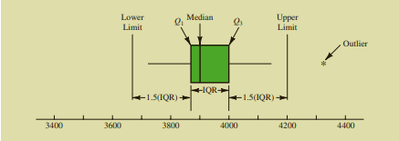
```

-   **Inferential statistics** uses sampled data to draw conclusions about the population. This includes testing various hypotheses statements you may have about the population where the data was obtained such as whether certain variables follow a specific distribution or whether the observed relationship between two or more variables, from a graph, is significant. For instance, suppose that you are a quantitative analyst for a bank and you want to test the hypothesis that the average loan amount for male clients is large than that of female clients. This type of test can be easily performed using the Data Analysis tool in Microsoft Excel.

### Advantages and disadvantages of data exploration

Data exploration has several benefits, including:

-   Offering a comprehensive understanding of the data set before conducting the actual analysis.

-   Enhancing the quality of the data.

-   Highlighting important features and potential issues

-   Providing insight into appropriate analysis techniques 

-   Guiding future research questions and directions

Limitations of data exploration may include:

-   Difficulty visualizing the high-dimensional data

-   May become complex for complicated data structures

-   It can be time consuming and subjective.

-   Misrepresenting data by choosing the wrong summary indicators

### Stages in the exploratory data analysis process

The data exploration process involves a series of stages or steps which are aimed at obtaining a comprehensive understanding of the data and the implications thereafter. This includes

1.  Understand the problem understudy

    A crucial first step in the EDA process is to clearly state the problem that led to the collection of the data. This will help in various ways, such as formulating relevant questions, choosing the appropriate analytical tools and identifying inconsistencies or anomalies in the data.

2.  Examine the structure of the data

    Once you have a clear understanding of the problem, the next step is to familiarise yourself with the data by examining its structure which includes the size of the data, the number of variables and their data types. Check for inconsistencies and anomalies in the data and also missing values or data entries.

3.  Handle the inconsistencies, anomalies and missing values

    The next crucial step is to have a strategy to handle any inconsistencies, anomalies and\\or missing data entries identified in the second step.

4.  Examine the statistical aspects of the data

    After addressing the issues identified in the second step, the next step involves the examination of the distribution, central tendency and variability of all the numerical variables. Moreover, various assumptions about the data can be tested. Among other things, this exercise will assist in identifying variables that deviate from expected patterns and may need further processing.

5.  Transform the data for analysis

    The next step is to prepare the data to be ready for data analysis. Based on your insights from the previous step, you may have to apply certain transformations to the data to make them conform to expectations. This involves, among others, standardizing or normalizing numerical variables, taking the log or square root to correct for skewness in numerical variables and dummy coding categorical variables.

6.  Visualize the data

    After transforming the data, you can now visualize it using tables and graphs such as frequency distributions and histograms. Data visualization is covered in some detail in Section \@ref(sec1-6).

7.  Communicate the findings and use them for further data analysis.

### Exercises to Section 1.5

**Question 1**

What is data exploration?

**Question 2**

For each of the following scenarios, identify the approach used for data exploration:

a\. A research team analysed the health data of City of Tshwane residents. They found that 12% of the residents have at least one non-communicable disease.

b\. An environmental scientist analysed data on monthly carbon dioxide (CO~2~) emissions and the monthly number of people hospitalized for respiratory issues in Pretoria. A scatter plot showed that there is a positive relationship between these two variables.

c\. A fitness instructor analysed data on the exercise patterns of people in the district of the Cape Winelands in the Western Cape. She plotted the data on a histogram and found a bimodal distribution of exercise habits, suggesting that there are two distinct behavioural groups.

d\. A marine biologist analysed data collected over 10 years by sensors from the bottom of the Indian ocean. She found that the average temperature was 24 degrees Celsius.

e.A hospital administrator at Hatfield General hospital claims that less than 10% of the daily hospital admissions are for serious injuries. In an analysis of hospital data, he was able to confirm his claim.

## Data visualization – Foundations and Concepts {#sec1-6}

According to the [Harvard Business Review](https://hbr.org/2016/06/visualizations-that-really-work), data visualization is a must-have data literacy skill for junior and even senior management. This is because it provides the only way for them to make sense of the work they do. As the world becomes more complex, most problems are increasingly hard to understand, much less fix, if they cannot be visualized. In modern society, organizations and individuals can use data visualization to generate and illustrate ideas or discover patterns, trends and outliers in the data.

Data visualization is the graphical representation of data using charts, graphs, maps, animations and infographics. The goal of visualizing data is to clearly and effectively communicate the key characteristics of a data set in a way that is easy to understand.

### Common uses of data visualization in modern society

-   **Comparison and benchmarking** – visualizing data can allow us to compare observations, variables or time periods. For instance, a meteorologist might want to compare the amount of rainfall before and after the first industrial revolution.

-   **Monitoring and tracking** – Data dashboards (such as Tableau® and Microsoft’s Power BI) can be used to monitor key performance indicators (KPIs) in a company or organization in a manner that is easy to read, understand and interpret. For instance, in order for the manager of a local Shoprite store to ensure enough merchandise on hand, the manager can refer to a real-time data dashboard showing the hourly sales volumes, inventory on hand, hourly number of transactions processed.

-   **Data exploration** – as already mentioned in Section \@ref(sec1-5), data visualization is a core step in EDA.

-   **Hypothesis testing** – results from visualizing data can be used as an informal approach to formulate and test hypotheses. For instance, the plot in the figure below can lead us to hypothesize that there is a positive linear relationship between the volumes of electric vehicle sales (in R millions) and the number of television advertisements.

```{r,echo=FALSE,fig.align='center',fig.cap="Scatter plot of electric vehicle sales (in R millions) and the number of advertisements",out.width="80%"}
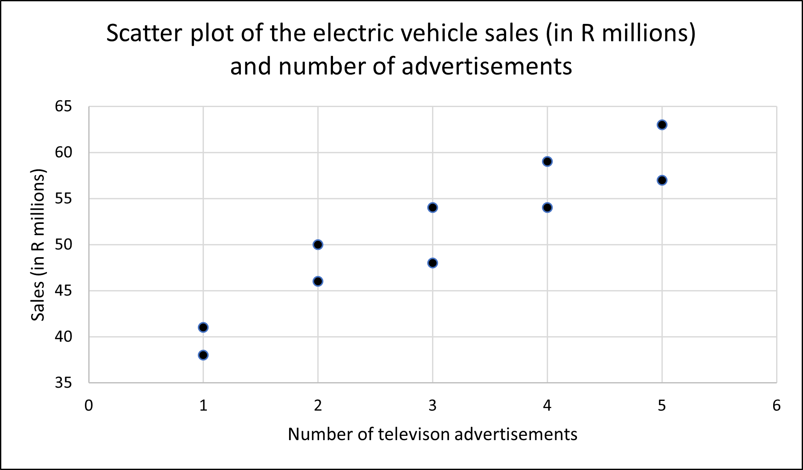
```

-   **Educational and knowledge sharing** – visualizations can simplify complex topics and make information more easily accessible to the general public in order to support education and training.

### Types of data visualizations

The choice of a data visualization tool depends on the purpose of the study and the type of data available.

1.  For the purpose of visualizing the distribution of the data, we can make use of a

    a.  **Frequency distribution** – show the number of observations in each of several non-overlapping categories or classes for both numerical and categorical data.

    b.  **Bar chart** – to show the frequency distribution for a categorical variable.

    c.  **Pie chart** – to show the relative frequency distribution for a categorical variable.

    d.  **Dot plot** – to show the distribution of a numerical variable over the entire range of the data.

    e.  **Histogram** – to show the frequency distribution of a numerical variable over a set of class intervals.

    f.  **Stem-and-Leaf** – to show the rank order and shape of the distribution of numerical data.

    g.  **Box-and-Whisker plot** – to show the distribution of numerical data using five numbers calculated from the data.

<!-- -->

2.  For the purpose of identifying whether or not the data has a trend overtime, we make use of a

    a.  **Line chart** which can be used to visualize time series data.

3.  For the purpose of making comparisons between two or more variables in a data set, we can make us of a

    a.  **Multiple boxplots** – to compare the distributions of two or more numerical variables.

    b.  **Side-by-side or stacked bar charts** – to compare two categorical variables.

    c.  **Pivot-tables (crosstabulation)** – to compare the frequency distribution of two categorical distributions.

4.  For the purpose of describing the relationship between numerical variables we can make use of

    a.  **Scatter plots** to (1) represent the relationship between two numerical variables, (2) identify the type of pattern represented in the scatter plot (linear constant upward or downward trend, curved pattern or no apparent pattern at all); (3), if there is a pattern, determine how strong is the pattern (do all the points follow the pattern exactly or not? In Section \@ref(sec1-7), we will define a numerical measure that can quantify the strength of a linear pattern) and (4) identify if there are any unusual observations (points that are far from the cluster of the majority of the points).

5.  For the purpose of displaying geographical data, we can make use of

    a.  **Heat map** – to show the intensity or density of a variable across a geographical area using a color gradient. These maps are effective for visualizing, for instance, crime hotspots.

    b.  **Flow map** – to show the direction and magnitude of the movement, migration or flow of people, goods or information between different locations.

    c.  **Choropleth map** – to represent quantitative or qualitative data associated with geographic regions such as countries. In contrast to a heat map, in a choropleth map, the geographic regions are not based on the variable of interest but are chosen based on known spatial information. These maps are effective for visualizing data on, for instance, population density or income levels.

    d.  **Cartograms** – to show the relative influence or importance of different geographical regions based on some quantitative variable such as population size. These visual tools work by distorting the size of the geographical regions by making them proportional to the numerical value of the variable of interest. For instance, geographic regions with larger population sizes will be larger on the map.

    e.  **Point maps** – to show the location of a specific outcome, such as the site of a wildfire, on the map.

    f.  **Bubble maps** – to show the relative magnitude of a specific outcome, such as the impact of a wildfire at a specific location, on the map. The larger the bubble, the higher the impact.  

### Components of a data visualization tool

In order for a visual summary to effectively communicate the message behind the data, it must possess the following core features:

-   An appropriate descriptive title that explains the data being shown.

-   Clear labels with the units of measurements and appropriate scales for both the x-axis (horizontal) and y-axis (vertical).

-   A legend identifying the different data series, where appropriate.

The figure below shows a graph of the 14-day Covid-19 infection rate in the South Africa provinces of Gauteng and Kwa-Zulu Natal for the period 1 December 2020 to 28 February 2021.

```{r covid-1,out.width="70%",,echo=FALSE,fig.ncol=2,fig.align='center',fig.cap="The 14-day Covid-19 infection rate in the South African provinces of Gauteng and Kwa-Zulu Natal for the period 1 December 2020 to 28 February 2021"}
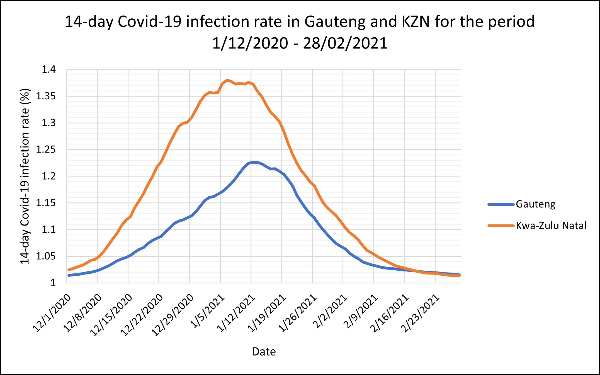
```

Figure \@ref(fig:covid-2) is a copy of Figure \@ref(fig:covid-1) highlighting the core features of a graph.

```{r covid-2,out.width="70%",echo=FALSE,fig.align='center',fig.cap="Same as Figure 2.3"}
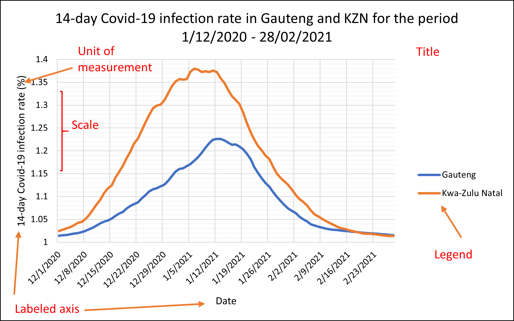
```

### Advantages and Disadvantages of data visualization

Data visualization can be an advantageous skill to have because

-   it appeals to any audience which means you can communicate the data to anyone;

-   it allows you to communicate efficiently and effectively about data;

-   quickly detect patterns or anomalies in the data;

-   it facilitates timely decision-making;

While there are many obvious advantages to data visualization, there are also some less obvious disadvantages to data visualization such as:

-   using the wrong visualization tool;

-   concluding from a scatter plot that the observed correlation implies causation;

-   making biased conclusions.

-   Due to their ease of apprehension, they can often be used to spread misinformation.

### Exercises to Section 1.6

**Question 1**

What is data visualization?

**Question 2**

For each of the following scenarios, specify the appropriate visualization technique (s):

a.  The City of Tshwane is concerned about income inequality, the mayor wants to investigate the distribution of income.

b.  In an effort to efficiently allocate police personnel, the City of Johannesburg wants to know which areas have the most criminal incidents.

c.  The forestry, fisheries and the environment ministry of South Africa wants to compare the greenhouse gas emissions across industries in the primary, secondary and tertiary sector.

d.  The Western Cape province has noted an increase in the number of people from other parts of South Africa, the administration wants to know what is the province of origin for most of the migrants?

e.  A botanist wants to understand the effect of temperature on the rate of growth of a plant.

**Question 3**

For each of the following scenarios, specify whether or not the chosen visualization technique is appropriate, if not, state the reason and specify an appropriate technique:

a.  A financial analyst uses a pie chart to identify the trend in the rand-dollar exchange rate for the period 2000-2020.

b.  A psychologist uses a box-and-whisker diagram to identify outliers in terms of IQ.

c.  A zoologist uses a line chart to compare the territory sizes between male tigers and female tigers.

d.  A sociologist uses a bar chart to study the relationship between an individual’s years of education and their voting frequency.

**Question 4**

The following is a pie chart of the soft-drink preferences of 50 individuals in South Africa:

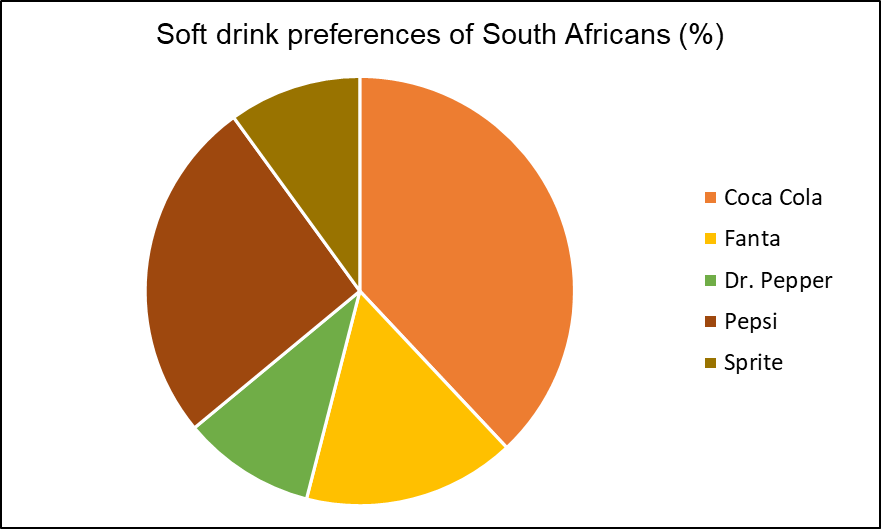{width="400"}

Identify what is wrong with the above visualization.

## Data analysis – Foundations and Concepts

Data analysis is the process of systematically using statistical techniques to explore, clean, transform and model data with the purpose of discovering useful information which can then be used to support decision-making.

### The Data Analysis process

Data analysis can be viewed as a sequence of steps combining some of the data literacy skills we have already discussed so far in this book. This process can be summarized as follows:

1.  **Define the study**

    The first and important step in the data analysis process is to clearly define the problem that the analysis aims to address by stating the objectives and specific questions that the analysis aims to answer.

2.  **Data collection**

    Once the study is defined, the next step is to collect the relevant data. This can be done using various methods to be discussed in Chapter \@ref(ch3). The choice of method used to collect data depends on the nature of the problem and the questions being asked.

3.  **Data cleaning**

    After collecting the data, the next step is to clean the data. This involves identifying and rectify errors, missing values and inconsistencies in the data. Data cleaning will be further discussed and practically demonstrated in Chapter \@ref(ch2).

    **Note:** The second and third step are part of data management. See Section \@ref(sec1-3) for more details.

4.  **Data exploration**

    After cleaning the data, we conduct a preliminary analysis to understand the characteristics of the data. See Section \@ref(sec1-5) for more details on how this is done in practice.

5.  **Data transformation**

    Following from the results of the exploration phase of the data analysis, the data is prepared for analysis by encoding categorical variables, scaling (normalizing or standardizing) some numerical variables and, if necessary, handling outliers.

6.  **Data modelling (analysis)**

    Now the data is ready for the actual analysis. This step involves using statistical and mathematical techniques on the data to discover patterns, relationships, similarities or trends.

7.  **Interpretation and visualization**

    After the data analysis, the next step is to interpret the obtained results and present them in a manner that can be easily understood. This can be done through visualization.

### Approaches to Data Analysis

There are different types of data analysis and each one serves a unique purpose. The choice of which one to use will depend on the nature of your study and what kind of questions you seek to answer.

1.  **Descriptive analysis** is used to describe and summarize the collected data to understand what happened in the past. For example, a university might use descriptive analysis to find out how many first-year students passed last year.
2.  **Diagnostic analysis** follows descriptive analysis by going a step further to explain or diagnose why something happened. For example, suppose the number of first years that passed last year dropped significantly, diagnostic analysis can be used to find out why this happened.
3.  **Predictive analysis** is used to forecast or predict what might happen in the future based on historical data. For example, a university can use predictive analysis to predict the number of first-year students that will pass next year. In other words, based on what has happened in the past we can find out what could happen in the future.
4.  **Prescriptive analysis** is used to make recommendations on what course of action to take in order to reach a desired outcome. For example, suppose a university wants to increase the pass rate for first-year students, a prescriptive analysis might suggest the best course of action towards reaching this outcome.

### Uses of data analysis in modern society

Data analysis is a very important data literacy skill that finds application across various fields and domains of application such as:

-   **Marketing research**, where it can be used to assist businesses to understand market trends, consumer preferences and help identify opportunities for product development.

-   **Medical diagnosis**, where it can be used to interpret medical images (e.g. MRI scans) and also assist in early detection of a disease.

-   **Medical drug discovery**, where it is used by pharmaceutical companies, such as Johnson and Johnson, to develop a drug by conducting clinical trials and testing the effectiveness of the drug.

-   **Fraud detection**, where it can be use by banks to identify unusual transaction patterns and detect fraudulent activities.

-   **Risk management**, where it is used by financial services companies to assess a client’s credit risk (i.e. will they be able to pay back the loan) and model risks in the forex market or stock market.

-   **Quality control**, where it is used to monitor and control the quality of products on the production line.

-   **Social science research**, where it is used to analyze survey data to study overall human behavior and sentiment.

-   **Recommendation systems**, where it used by platforms such as Spotify and Netflix to recommend music or shows that you might like based on the content that you viewed in the past.

-   **Environmental monitoring**, where geographical (remote sensing) data is used to monitor ecological changes such as deforestation, water quality and air pollution.

### Data analysis techniques

There are many techniques used in data analysis and each one serves a unique purpose and application. In section [Data exploration], we discussed data exploration. This is the most basic technique for data analysis. In this section, we will briefly discuss some of the most commonly used and emerging techniques.

1.  **Correlation analysis**

    Correlation analysis is a technique used to understand the linear relationship between two or more numerical variables. A simple measure that is commonly used to describe this relationship is the **correlation coefficient**, usually denoted by $r$. The correlation coefficient is used to quantify the strength of the linear relationship between two numerical variables. The value of $r$ will always lies between $-1$ and $1$. Values close to $-1$ or $+1$ indicate a strong linear relationship. The closer the value of $r$ is to zero, say less than 0.5 or more than -0.5, the weaker the linear relationship. As an example of the use of the correlation coefficient, suppose we want to know the strength of the relationship between a student’s matric final mark and their final mark at the end of their first-year of study at a university. Given a correlation coefficient of $r=0.93$, we can say that there is a strong positive linear relationship between a student’s matric final mark and their first-year final mark. In other words, a larger final matric mark is strongly associated with a larger first-year final mark. Finally, please note that correlation measures the linear association between two numerical variables and not necessarily causality. In other words, a high correlation between two variables does not mean changes in one variable will cause changes in the other variable.

2.  **Regression analysis**

    Regression analysis is a statistical technique used to understand the dependence of one variable, known as a dependent variable, on one or more other variables, known as independent variables. It is commonly used for predictive analysis. A simple and widely applicable approach to regression analysis is the least squares line. Consider two numerical variables $x$ and $y$ which are assumed to follow a straight line pattern. The relationship between $x$ and $y$ can be described using a straight line given by the equation

\begin{equation}
y=A+Bx (\#eq:eq1)                                            
\end{equation}

where $y$ is the dependent variable, assumed to depend on $x$ known as the independent variable. The term $A$ is the y-intercept and $B$ is the slope which represents an increase in $y$ for every unit-increase in $x$. For a given sample of $(x,y)$ points, we can obtain an estimate of \@ref(eq:eq1), given by,

\begin{equation}
\hat{y}=a+bx (\#eq:eq2)                                          
\end{equation}

where $a$ and $b$ are estimates of $A$ and $B$, respectively, obtained by the method of least squares. Hence, equation \@ref(eq:eq2) is known as the least-squares regression line.

Equation \@ref(eq:eq2) can be used to:

-   describe the dependence of $y$ on $x$ allowing us to learn more about the process that produces $y$.
-   comment on the type of linear pattern between $x$ and $y$ (whether its positive, $b>0$, negative, $b<0$, or no pattern exists, $b=0$).
-   measure the influence that $x$ has on $y$ based on the magnitude of the value of $b$.
-   predict the future value of $y$ for a given value of $x$.

As an example of the use of the least-squares line for regression analysis, consider the least squares line $\hat{y}=60+5x$ estimated to a data set on student population (in 1000s), $x$, and quarterly pizza sales (R 1000s), $y$, for a sample of 10 restaurants located near university campuses. The following points can be made about the fitted least-squares line:

-   $b=5>0$ which implies that as student population, $x$, increases, quarterly sales increase.

-   $a=60$, which means for a restaurant that is not located close to a university (that is, $x=0$), the quarterly sales are $R60000$.

Lastly, we can use the least-squares line to predict the quarterly sales for a given size of the student population. For $x=16$, representing 16000 students, the quarterly sales are predicted to be $\hat{y}=60+5(16)=140$ or $R140000$.

3.  **Cluster analysis**

    Cluster analysis is used to group a set of objects or entities in such a way that objects in the same group (or cluster) are more similar than those in other clusters. It is commonly used in recommendation systems and market research to find consumers with similar preferences.

4.  **Dimension reduction**

    As implied by the name, this technique is used to reduce a large number of variables into few variables in such a way that the remaining variables capture the maximum possible information from the original variables. It is commonly used in conjunction with some of the already-mentioned techniques such as cluster analysis for medical diagnosis.

5.  **Hypothesis testing**

    This technique is used to make inference or statements about population characteristics (such as the mean) using sample data. It is commonly used in the control and monitoring of quality in a production process.

6.  **Time series analysis**

    This technique is used for the analysis of time-series data. It is commonly used for predictive analysis and understanding the trend overtime. It is commonly used in forecasting or predictive analysis.

7.  **Sentiment analysis**

    This technique is used to extract the emotional tone (negative, positive or neutral) behind text data. It is commonly used to understand customer feedback.

8.  **Spatial data analysis**

    This technique is used for the analysis of geographical (remote sensing) data, that is data with a spatial component (e.g. geographic location represented by coordinates). The most important use of this technique is in disease tracking to identify hotspots.

### Computational tools and software for data analysis

Modern data analysis is carried out using sophisticated computational tools and software that cater for different needs and levels of expertise. This includes

1.  **Python**

    Python is the most popular high-level general-purpose programming language that can be used for a variety of tasks including data analysis. It is relatively easy to learn and has a range of libraries (pandas, NumPy and Matplotlib) that make it a favorite data analysis and visualization tool among data analysts and data scientists.

2.  **R programming language**

    R is an open source (free software) programming language developed specifically for statistical computing and visualization. Overtime, R has evolved to have a wide set of capabilities such as statistical software development and scientific text editing. It is a popular software among statisticians because it features tools such as hypothesis tests, correlation analysis, regression analysis, among many others.  

3.  **SQL (Structured Query Language)**

    SQL is a language for managing and manipulating data that is sored in databases.

    Note that it is not necessary to know programming in order to do data analysis. The following are the most popular non-programming data analysis tools used in industry:

4.  **Excel**

    Microsoft Excel is a spreadsheet that is most widely used for data analysis because it is easier to use. It offers a range of features for data collection (using the Sampling tool), exploration (using the Descriptive Analysis tool), modelling (using the Regression Analysis tool) and visualization (using the Charts tool).

5.  **SAS (Statistical Analysis System)**

    SAS is an advanced license-based software developed specifical for statistical data analysis and visualization. It is made up of procedures that can perform tasks such as data exploration (PROC MEANS), hypothesis testing (PROC TTEST) and many others.

6.  **Power BI**

    Power BI is a powerful business analytics tool developed by Microsoft. It enables users to create interactive visualizations with self-service business intelligence capabilities. Power BI is used to transform raw data into useful insights that are easy to understand through dashboards and reports.

7.  **Tableau**

    Tableau is a business analytics tool used to create interactive and shareable dashboards that show trends, variations and densities for important day-to-day business metrics through charts and graphs.

### Exercises to Section 1.7

**Question 1**

For each of the following case studies, specify which type of data analysis is appropriate:

a\. Eskom wants to reduce overall electricity waste and improve the stability of the national electricity grid. To achieve this, they want to propose energy-saving strategies to its customers.

b\. Absa has noticed a decrease in their corporate clients overtime. They want to know what could be behind this.

c\. In order to inform her decision on many warm clothing to bring on her trip to Essen, Germany in January, Renate wants to know what the average temperature will be in Essen, Germany in January.

d\. In order to inform their decision on the interest rate at their next meeting, the South African Reserve Bank wants to know what the inflation rate will be in the next 12 months [predictive].

e\. A general practitioner (GP) wants to know how many COVID-19 patients she treated between 2020 – 2022.

**Question 2**

For each of the following case studies, specify which data analysis tool (s) is/are appropriate:

a\. Given past data on electricity consumption, Eskom wants to determine the amount of electricity that will be consumed in the next winter season.

b\. A plant physiologist wants to understand dependence of plant growth on factors such as water availability, temperature and soil nutrient levels.

c\. Suppose that you want to study the response of a plant to changes in temperature, drought, salinity.

d\. A biochemist wants to classify proteins with similar structural characteristics.

e\. The World Health Organization (WHO) wants to identify geographic hotspots for the monkeypox disease.

f\. The WHO wants to understand public opinion about a new strain of virus from social media posts.

g\. In order to inform their decision on the interest rate, the South African Reserve Bank (SARB) wants to forecast the average value of the rand per US dollar in the next 12 months.
