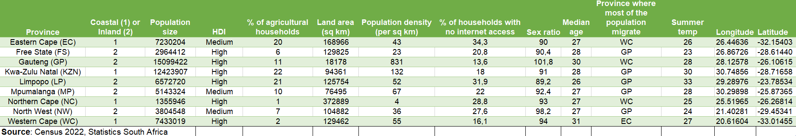
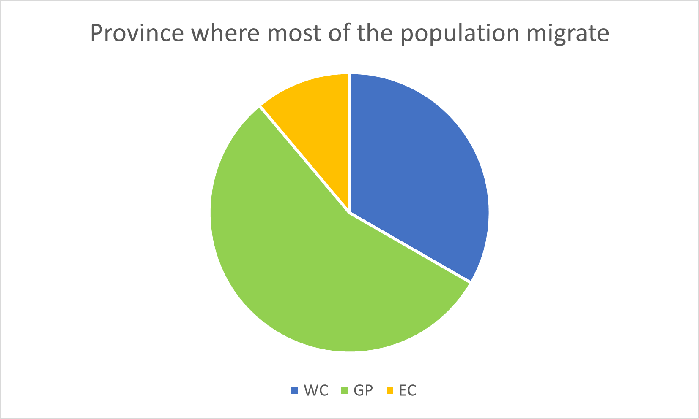
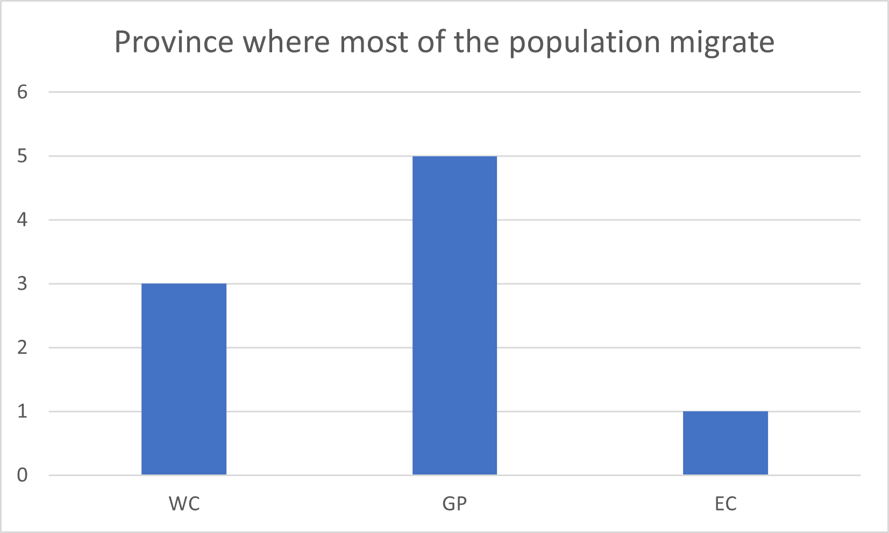
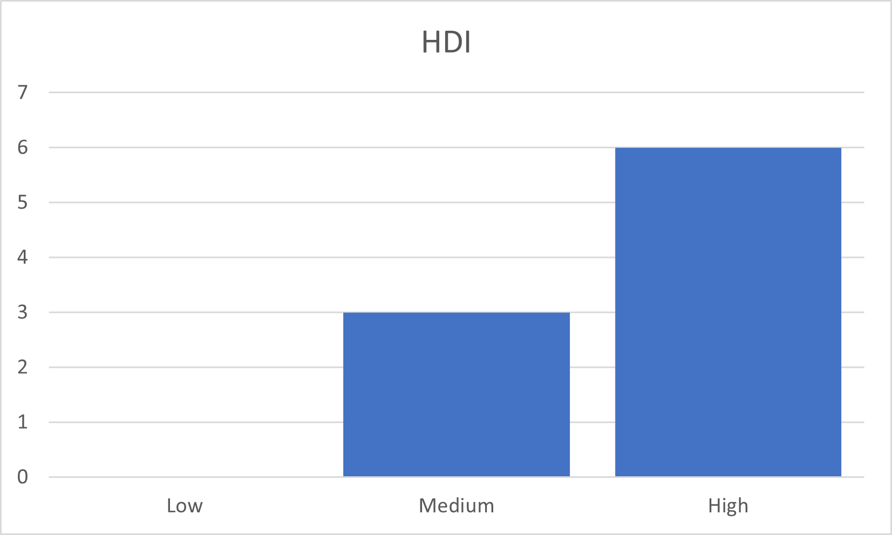
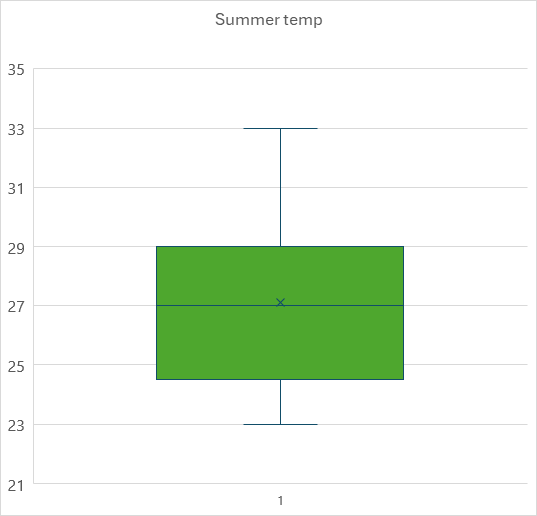
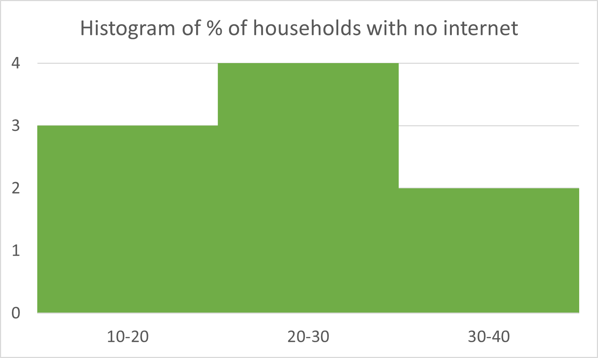
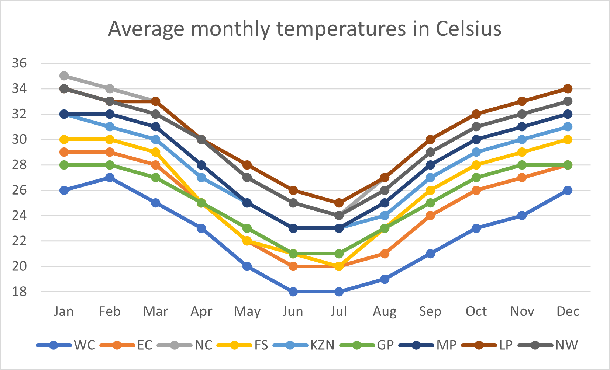
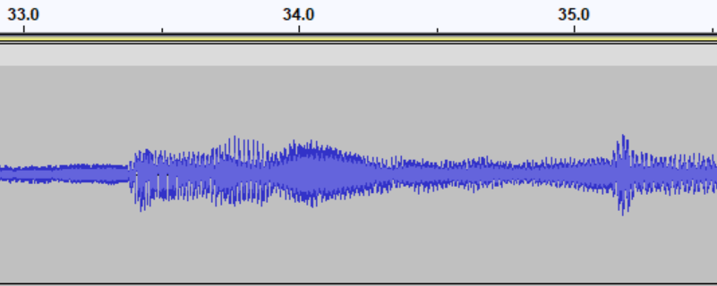

```{r setup1, include=FALSE}
knitr::opts_chunk$set(echo = TRUE)
```

# Sources and Types of Data {#ch2}

## Data Sources {#sources}

### Introduction {#sources:intro}

As statisticians, data analysts, data scientists or any other practitioners who work with data, our job is all about getting insights from data. But  where does this data come from? Knowing where a dataset comes from and where and how it was collected is crucial for us to determine if it will allow us to derive the insights we need.

Example:
Ahmed is a consumer scientist working for Freshdale, a South African dairy company. His job is to determine whether Freshdale should invest more money into producing milk, cheese or yoghurt. For each of the datasets below, discuss if it is appropriate to answer this question.

A) A spreadsheet listing the current production of milk and yoghurt from the farms that supply to Freshdale.
B) A dataset on trends in lactose intolerance in South Africa.
C) Results from a survey on dairy product consumption in South Africa conducted in 2024, which targeted the rural population in KwaZulu-Natal.
D) Results from a survey on milk, cheese and yoghurt consumption in Angola conducted in 2024, targeting the entire population.
E) Results from a survey on dairy product consumption among Fresdhale's consumers conducted in 2021.

Possible answers:

A) The spreadsheet will be informative regarding the current production of dairy products. However, this will not tell Ahmed what people are actually consuming. It may thus not be helpful to determine the demands of the market.
B) A dataset on lactose intolerance would not be useful, since lactose intolerant people are not (typically) included in the market for dairy products. (Lactose-free dairy products are becoming increasingly common, but determining the market need for these products is not the question Ahmed is trying to answer.)
C) Although this information is quite recent, and based on South Africa, the survey targeted the rural population in KwaZulu-Natal only. The needs of this community may differ from the needs of the suburban and urban populations in KwaZulu-Natal, and the rural, urban and suburban populations in other provinces.
D) Although this survey is recent, and targets the entire population including urban, rural and suburban, Ahmed would have to account for the fact that the dairy market in Angola may be quite different from the dairy market in South Africa.
E) A survey targeted at Freshdale's consumers would certainly provide the most relevant information out of all of the above options. However, it should be taken into account that the survey is a few years old, and may not reflect the needs of the market in 2025.

In the above example, the data sources were all examples of **secondary data sources**. The next sections will introduce **primary, secondary and tertiary** data sources, provide examples of these data sources, and discuss scenarios in which they are appropriate. The last section in this chapter will present examples of where to find open data online.


### Primary Data Sources {#sources:primary}
Primary data sources are collected first-hand for the purpose of a specific study. Examples of primary data sources include:

- Surveys: A survey that is created by a researcher to answer a specific question. In the example of Freshdale, Ahmed could create a primary data source by conducting his own survey on dairy consumption.
- Interviews: In-depth interviews with individuals to determine their opinions and experiences.
- Experiments: Laboratory experiments that are tailored to answer a specific question.
- Field Data: Observations of data in a natural environment, such as data on animal movement and behaviour.
- Direct Measurements: Direct measurements involving the use of a specific tool, like a thermometer to measure patient temperatures, a GPS device to capture the locations of mineral deposits, or a sensor that measures chlorophyll in leaves.

Can you think of other examples of primary data sources?

**Remember: A primary data source is always created by the researcher themselves to answer a specific question or questions.**

Primary data source pros and cons:

Pros:

- Data is specifically suited to the research question
- Data is current and up-to-date
- Data is accurate and reliable (assuming the researcher followed correct data collection protocols)

Cons:

- Data collection can be expensive
- Data collection can take a long time
- If you as a researcher create a primary data source through data collection, you are responsible for its accuracy, reliability, and the ethics of data collection!


### Secondary Data Sources {#sources:secondary}

Secondary data sources are pre-collected by a different researcher for a purpose other than the current research question. In the Freshdale example, the surveys and datasets that Ahmed could choose from were collected by other researchers, in different years and different countries, to answer their own questions. 

Consider the survey on dairy product consumption in the rural population of KwaZulu-Natal. Let us say that Ahmed's colleague Amina created that dataset. For Amina, it was a primary data source, since she collected the data herself in order to answer a specific question. Ahmed did not collect that dataset, and would be using the dataset to answer a different question. Thus, it would be a secondary data source for Ahmed.

Examples of secondary data sources include:

- Open datasets provided on websites like Kaggle, the United Nations Office for the Coordination of Humanitarian Affairs (OCHA), and others.
- Government datasets and data bases (e.g. the census collected by StatsSA).
- Market research datasets providing insights into consumer trends, from companies like McKinsey.
- Data provided in academic papers.
- Social media data, such as tweets scraped from X.
- Historical data from archives and records.

Can you think of other examples of secondary data sources?

**Remember: A secondary data source was created by another researcher to answer a different research question.**

Discuss: If Ahmed conducts a survey on dairy consumption in South Africa in 2025, is it a primary or secondary data source? If Ahmed then uses this data in 2026 to analyse only milk consumption, is it a primary or secondary data source?

Secondary data source pros and cons:

Pros:

- Obtaining data is easy
- Some datasets could be available for free (e.g. government and open data)
- It does not take long to obtain data
- Data is usually provided in a usable format

Cons:

- Data is not specifically suited to the research question
- Data is from the past (you will need to evaluate its relevance in the present)
- The accuracy, reliability and ethical nature of the data cannot be controlled by you as the researcher. Although you can clean the data, you cannot go back and change how it was collected.

**Note: Secondary data is not guaranteed to be clean, accurate, reliable or ethical. As a researcher using the data, it is still your responsibility to check these aspects before using the data in your own research.**

### Tertiary Data Sources {#sources:tertiary}

Tertiary data sources summarise and describe the information contained in primary and secondary data sources. They can provide a very useful starting point to study, understand and research a particular topic. However, they cannot be used to answer research questions in the same way as primary and secondary data sources.

Examples of tertiary data sources include:

- Textbooks that explain and summarise existing information on a particular topic. (These notes are an example of a tertiary data source!)
- Abstracts that summarise the contents of a research paper or thesis.
- Review articles that present and discuss the latest research on a particular topic.
- Encyclopedias that provide an overview of certain topics. 
- Databases and search engines like Google Scholar or library databases that contain links to books and papers on specific topics.

Can you think of other tertiary data sources?

**Remember: A tertiary data source is a summary of primary or secondary data sources.**

In the Freshdale example, Ahmed might want to read a review paper discussing the latest research on dairy consumption.

### Where Can I Find Data? {#sources:where}

The list below describes some sources of open international data.

- Kaggle: A popular platform for data science enthusiasts that hosts a wide range of datasets on topics like social media, climate change, and more. It also includes competitions and collaboration opportunities for machine learning projects. URL: https://www.kaggle.com/
- Data.gov: A comprehensive portal managed by the U.S. government offering datasets across various fields like health, education, and transportation. It provides data in formats like CSV, JSON, and XLSX to promote transparency and innovation. URL: https://data.gov/ 
- World Bank Open Data: Provides access to global development data, including indicators on poverty, health, education, and economics. Tools for visualisation and analysis are also available. URL: https://databank.worldbank.org/
- Google Trends: Allows exploration of search trends across time and regions, which can be useful for understanding consumer behavior or tracking specific phenomena. URL: https://trends.google.com/trends/ 
- OpenStreetMap: Offers free geographic data like maps, street layouts, and points of interest, suitable for research in urban planning and transportation. URL: https://www.openstreetmap.org/
UN Data: A platform with diverse datasets on global issues like population, education, and health, curated by the United Nations. URL: https://data.un.org/
- Climate Data Online (NOAA): Focused on climate-related datasets, this platform includes historical weather data, marine data, and more for researchers and policymakers. URL: https://www.ncei.noaa.gov/cdo-web/ 
- European Data Portal: For those interested in European datasets, this platform aggregates data on demographics, economics, and other regional statistics. URL: https://data.europa.eu/en 

The list below describes some sources of open African data.

- World Bank Open Data - Africa Development Indicators: This database provides a detailed collection of macroeconomic, sectoral, and social indicators for 53 African countries, with data spanning multiple decades. Topics include poverty, education, and social development. It is a rich resource for monitoring development programs in the region. URL: https://databank.worldbank.org/source/africa-development-indicators
- African Data Portal by NBER: The National Bureau of Economic Research hosts a portal specifically for datasets on Sub-Saharan Africa, systematising public-use data. This includes diverse economic, demographic, and health data that are accessible for researchers. URL: https://www.nber.org/research/data/portal-public-use-datasets-sub-saharan-africa 
- Humanitarian Data Exchange (HDX): Managed by the UN Office for the Coordination of Humanitarian Affairs, HDX provides open data sets on humanitarian issues across Africa. Topics include conflict, health, food security, and migration. URL: https://data.humdata.org/ 
- Global Biodiversity Information Facility (GBIF): GBIF offers biodiversity data with extensive records on species found in Africa. This resource supports research in conservation, climate change, and ecosystem services. URL: https://www.gbif.org/ 


## Data Types {#types}

### Introduction {#types:intro}

As a statistician, data analyst, data scientist or a professional in any similar career, it is important to understand the different types of data. Intuitively, this makes sense: we understand that someone's height is fundamentally different information from their blood pressure, favourite vegetable, or their name. We also understand that these different kinds of data cannot be directly compared. 

As an example, consider two friends, Shamila and Kagiso. Shamila is 160cm tall, has a systolic blood pressure of 110, and likes broccoli. Kagiso is 180cm tall, has a systolic blood pressure of 119, and likes carrots. We can say that Kagiso is taller than Shamila, but we cannot say that Kagiso is taller than his blood pressure. We can say that Kagiso's blood pressure is higher than Shamila's, but we cannot say that Kagiso's blood pressure is higher than broccoli (what would that even mean?). These differences may seem obvious in this example, but keep them in mind as we explore the different data types and scales of measurement.

### Scales of Measurement

Scales of measurement refers to the categories in which we divide data according to their properties, and which inform the appropriate kinds of analyses we can perform on the data. There are four scales of measurement, namely nominal, ordinal, interval and ratio.

Consider the example dataset below. This dataset displays some administrative, demographic, economic and agricultural data of the provinces of South Africa.

```{r, echo=FALSE, fig.cap="Figure 1: Provinces dataset", out.width = '100%'}

```

#### Nominal
Nominal data refers to data to which there is no order or ranking. In the Provinces dataset, there are three nominal variables. *Province* is a nominal variable, since there is no specific order to the provinces. *Province where most of the population migrate* is similarly a nominal variable.

Q: What is the third nominal variable in the Provinces dataset?

Nominal data is best represented by **bar charts** and **pie charts**.

```{r, echo=FALSE, fig.cap="Figure 2: Pie chart of the 'Province where most of the population migrate' nominal variable.", out.width = '50%'}

```

```{r, echo=FALSE, fig.cap="Figure 3: Bar chart of the 'Province where most of the population migrate' nominal variable.", out.width = '50%'}

```

Q: Would it be useful to make a pie chart or a bar chart of the *Province* variable? Why or why not?

#### Ordinal
Ordinal data refers to data that has an order, but where the difference in order cannot be measured. In the Provinces dataset, *HDI* (Human Development Index) is an ordinal variable. There is a clear order to the values of *HDI*, namely Medium or High. However, the difference in order cannot be measured quantitatively. We cannot, for instance, say that the Free State's HDI is "twice as medium" as that of the Eastern Cape, or that North West's HDI is "a third as high" as that of Western Cape.

Q: Can you think of other examples of ordinal variables?

Ordinal data is best represented by **bar charts**.

```{r, echo=FALSE, fig.cap="Figure 4: Bar chart of the 'HDI' ordinal variable.", out.width = '50%'}

```

#### Interval
Interval data refers to data that has an order, and where the difference in order can be measured, i.e. it can be quantified by a numerical value. However, the ratio between interval data values does not have a meaning, and there is no true zero. In the Provinces dataset, *Summer temp* is an interval-valued variable. This is because temperature does not have a true zero value. A temperature of 0 degrees Celsius is cold; it does not mean that there is *no* temperature.

Interval data can be represented by, among other things, **bar charts**, **histograms**, and **box plots**.

```{r, echo=FALSE, fig.cap="Figure 5: Box plot of the 'Summer temp' interval variable.", out.width = '50%'}

```

Q: Can you think of other examples of interval variables?

#### Ratio
Ratio data refers to data that has an order, where the difference in order can be measured quantitatively, and where the ratio between values has a meaning. The data also has a true zero. In the Provinces dataset, *Land area*, *Population density*, and *% of agricultural households* are examples of ratio variables.

Like interval data, ratio data can be represented by, among other things, **bar charts**, **histograms**, and **box plots**.

```{r, echo=FALSE, fig.cap="Figure 6: Histogram of the '% of households with no internet' ratio variable.", out.width = '50%'}

```

Q: Are the other ratio variables in the Provinces dataset? If there are, which ones are they?

#### Review:
Give the scale of measurement of the following variables and explain your answer.

- Province
- Coastal (1) or Inland (2)
- Population size
- HDI
- % of agricultural households
- Land area (sq km)
- Population density (per sq km)
- % of households with no internet access
- Sex ratio
- Median age
- Summer temp
- Province where most of the population migrate

If you are struggling to identify the scale of measurement of a variable, ask yourself the following questions:

1. Can you arrange the values of the variable in a particular order?
2. Does the difference in order have a numerical value?
3. Does the ratio of the values have a meaning?
4. Do the values of the variable have a true zero?

### Data Types

Data comes in many different forms, such as numbers, text, images, GPS coordinates, and many more. In this course, the two main data types we will consider are **quantitative** and **qualitative** data. Quantitative data has numerical values, and can be analysed using mathematical and statistical methods. Qualitative data has descriptive or categorical values.

#### Quantitative Data

Quantitative data can be measured or counted and expressed numerically. It is always expressed as numerical values. It is used to quantify concepts such as "how much," "how many," or "how often." it can be analysed using mathematical operations such as addition, subtraction, and more advanced statistical analysis.

In the Provinces dataset, *Population size*, *% of agricultural households*, *Land area (sq km)*, *Population density (per sq km)*, *% of households with no internet access*, *Sex ratio*, *Median age* and *Summer temp* are quantitative variables.

Q: Why is the variable *Coastal (1) or Inland (2)* not considered a quantitative variable, even though it is represented by a number?

Quantitative data is categorised into two main types: discrete and continuous.

##### Discrete Data

Discrete data is data that can be **counted**, and thus has integer values. Discrete data does not have fractions or decimals. In the Provinces dataset, *Population size* is a discrete variable. This is because it represents the number of people in a province. The number of people can be counted, and will always have integer values. One cannot have '0.75 of a person'!

Typically, discrete data can be expressed as 'the number of' something.

Q: What other examples of discrete data can you think of?

##### Continuous Data

Continous data is data that can be **measured**, and thus has real values. It can have fractions and decimals. In the Provinces dataset, *% of households with no internet access* is a continuous variable. This is because it represents a percentage, which can have decimals.

Q: What other examples of continuous data can you see in the Provinces dataset?

#### Qualitative Data

Qualitative data is used to categorise or describe phenomena. The scales of measurement associated with qualitative data are nominal and ordinal data. Answers to open-ended questions can also be examples of qualitative data.

In the Provinces dataset, *Province*, *Coastal (1) or Inland (2)*, *HDI* and *Province where most of the population migrate* are qualitative variables.

Other examples of qualitative data that you might encounter include:

- Product ratings: "Excellent," "Good," "Fair," "Poor"
- Colours: Red, blue, yellow
- Genres: Mystery, romance, action
- Brands: Apple, Samsung, Sony
- Responses to open-ended survey questions: "How do you feel about the semester?"

Q: What other qualitative variables can you think of?

Qualitative data can best be visualised by bar charts, pie charts, and word clouds. The image below shows a word cloud of keywords associated with tourism in South Africa.

```{r echo=FALSE}
suppressWarnings({library(wordcloud2)

words <- c("South Africa", "South Africa", "South Africa", "Cape Town", "Cape Town", "Cape Town", "Johannesburg", "Johannesburg", "Durban", "Durban", "safari", "safari", "Kruger National Park", "Kruger National Park", "Table Mountain", "Table Mountain", "Drakensberg", "Drakensberg", "Garden Route", "Garden Route", "Cape Winelands", "Cape Winelands", "Stellenbosch", "Stellenbosch","Sun City", "Big Five", "wildlife", "wildlife", "Elephant", "Rhino", "Lion", "Game Reserve", "Chapman's Peak", "beaches", "Indian Ocean", "Atlantic Ocean", "Panorama Route", "Panorama Route", "Blyde River Canyon")

freq_table <- as.data.frame(table(words))
set.seed(3801)
freq_table[,2] <- freq_table[,2] + rpois(nrow(freq_table),5)

wordcloud2(data=freq_table)
})


```

#### Quantitative vs qualitative data summary

The below table summarises the key aspects of quantitative and qualitative data, and the key differences between them.

```{r echo=FALSE, results='asis'}

dat <- c("Data type", "Nature", "Values", "Examples", "Visualisation", "Mathematical operations", "Qualitative data", "Descriptive, categorical", "Words, labels, categories", "Province names, brands, opinions", "Bar chart, pie chart, word cloud", "Not applicable", "Quantitative data", "Numerical, measurable, countable", "Numbers, counts, measurements", "Population size, percentages, income", "Histogram, scatter plot, line chart", "Applicable (e.g. sum, average)")
  
mat <- matrix(data=dat,ncol=3)

library(knitr)
kable(mat, caption='Differences between qualitative and quantitative data')

```


#### Other Data Types

The data available in the world today is growing exponentially in volume and diversity. Social media, fitness apps, website cookies, videos, GPS devices, satellites and many more sources of data are producing thousands of gigabytes of data every day. Although this chapter focused on quantitative and qualitative data types, with nominal, ordinal, interval and ratio scales of measurement, many more data types exist in our rapidly changing world. It is thus important for you to take notice of some common additional data types, which this section will highlight.

##### Date and time data

Date and time data can be measured as ordinal, interval or ratio data, depending on its nature.

- Ordinal: Dates including days of the week can be measured as ordinal data, since there is an order to these dates, but no meaningful numerical distance between e.g. Monday and Tuesday.
- Interval: Time on a clock (24 hours or 12 hours) can be measured as interval data, since it has no meaningful zero value.
- Ratio: The length of time between events can be measured as a ratio (continuous) variable, since it has a meaningful zero value.

##### Time series data

Time series data represent measurements taken over time, usually at regular intervals. It is used to study and understand patterns happening across time, and predict what may happen in the future. Examples of time series data include:

- Daily stock prices
- Daily traffic volume on a certain road
- Patient vitals (e.g. blood pressure) measured weekly
- Monthly sales

Time series can often be represented by line plots. Figure 7 shows the line plots of average monthly maximum temperatures for each of the provinces.

```{r, echo=FALSE, fig.cap="Figure 7: Time series of monthly maximum temperature per province", out.width = '50%'}

```

##### Image data
Image data is popular in the field of computer vision and AI. Images are typically represented as a set of three matrices, or grids, representing the red, blue and green values of each pixel in the image.

Figures 8 and 9 show an example of an image, and its decomposition into its red, green and blue components.

```{r, echo=FALSE, fig.cap="Figure 8: Example of image data (Photo by Andrew S on Unsplash)", out.width = '50%'}
knitr::include_graphics("Renate Chapters/andrew-s-ouo1hbizWwo-unsplash.jpg")

```

```{r, fig.height=8, fig.width= 30, echo=FALSE, fig.cap="Figure 9: An image split into its red, green and blue components",fig.align='center'}

suppressWarnings({suppressMessages({# Install required packages if not already installed
if (!require("imager")) install.packages("imager", dependencies = TRUE)
if (!require("gridExtra")) install.packages("gridExtra", dependencies = TRUE)

# Load libraries
library(imager)
library(gridExtra)
library(ggplot2)

# Load an example image (you can replace this with your own image file)
#image_path <- system.file("extdata", "andrew-s-ouo1hbizWwo-unsplash.jpg", package = "imager") # Example image
img <- load.image("Renate Chapters/catdog.jpg")

# Ensure the image is in RGB format
if (!is.cimg(img)) stop("The loaded image is not in a valid RGB format.")

# Split into RGB channels
red_channel <- as.cimg(img[, , 1, 1])   # Extract red channel
green_channel <- as.cimg(img[, , 1, 2]) # Extract green channel
blue_channel <- as.cimg(img[, , 1, 3])  # Extract blue channel

# Create a data frame for each channel
red_df <- as.data.frame(as.cimg(red_channel))
green_df <- as.data.frame(as.cimg(green_channel))
blue_df <- as.data.frame(as.cimg(blue_channel))

# Plotting each channel using ggplot
red_plot <- ggplot(red_df, aes(x = x, y = -y, fill = value)) +
  geom_raster() +
  scale_fill_gradient(low = "white", high = "red") +
  ggtitle("Red Channel") +
  theme_minimal() +
  theme(legend.position = "none") +
  theme(
    plot.title = element_text(size = 48),
    axis.title = element_text(size = 32),
    axis.text = element_text(size = 32)
  )

green_plot <- ggplot(green_df, aes(x = x, y = -y, fill = value)) +
  geom_raster() +
  scale_fill_gradient(low = "white", high = "green") +
  ggtitle("Green Channel") +
  theme_minimal() +
  theme(legend.position = "none") +
  theme(
    plot.title = element_text(size = 48),
    axis.title = element_text(size = 32),
    axis.text = element_text(size = 32)
  )

blue_plot <- ggplot(blue_df, aes(x = x, y = -y, fill = value)) +
  geom_raster() +
  scale_fill_gradient(low = "white", high = "blue") +
  ggtitle("Blue Channel") +
  theme_minimal() +
  theme(legend.position = "none") +
  theme(
    plot.title = element_text(size = 48),
    axis.title = element_text(size = 32),
    axis.text = element_text(size = 32)
  )

# Arrange the plots side by side using gridExtra
grid.arrange(red_plot, green_plot, blue_plot, ncol = 3)
})})
```

Images can also consist of more grids. Satellite images, for example, typically have additional grids with infrared values, water and vegetation indices, etc. These can be used to measure the presence of vegetation, water, and buildings, assess the health of vegetation, monitor climate change, and much more.


##### Spatial data
Spatial data is concerned with the locations of phenomena. Spatial data can include satellite images, GPS locations, GPS routes, and more. Figure 10 shows an example of a satellite image of central Pretoria, as well as GPS locations of some points of interest, and lines representing the roads. These are all examples of spatial data.

```{r, out.width= "49%", out.height="20%", echo=FALSE, fig.show='hold',fig.align='center', fig.cap="Figure 10: Top left: A satellite image; Top right: points of interest; Bottom left: roads; Bottom right: All previous datasets overlaid"}
library(graphics)

#par(mfrow=(c(2,2)))
knitr::include_graphics(c("Renate Chapters/Sat.jpg","Renate Chapters/POIs.jpg","Renate Chapters/Roads.jpg","Renate Chapters/Overlaid.jpg"))

```

Spatial data is used in urban planning, ecology, epidemiology (the study of disease spread), and more.

##### Audio data
Audio data can be found in sound files. This can include, among other things, music, audio tracks for movies, and voice recordings (like voice notes). Audio data is represented by a time series signal where the amplitude of the sound wave is sampled at regular intervals. Figure 11 shows an example of an audio file.

```{r, echo=FALSE, fig.cap="Figure 11: An audio file represented as a time series of amplitudes. Higher amplitudes represent a louder volume.", out.width = '50%',fig.align='center'}

```

##### Video data
Video data are series of images put together. Videos without sound are examples of video data. Videos with sound, such as movies downloaded from the internet, or videos taken with your phone, are a combination of video data (the visuals) and audio data (the sound).

#### Data Types and Computers

The last part of this chapter considers how data of different types are stored on computers. We will look at the possible values that the data can be stored as, and common file extensions for each data type.

##### Qualitative data
Qualitative data is stored differently depending on whether it is nominal, ordinal, or text data (e.g. a response to an open-ended survey question).

1. Nominal data: This is stored as labels, either text (for example, province codes like "GP", "WC", "LP") or as integers representing categories (for example, 1 to represent Coastland and 2 to represent Inland in the *Coastal (1) or Inland (2)* variable in the Provinces dataset).
2. Ordinal data: Stored in the same way as nominal data, but with an implied order.
3. Text data: Stored as **string** variables, which is a standard data type on computers.

Qualitative data can be stored in text files (file extention: .txt) or in spreadsheets (file extention: .csv, .xlsx).

##### Quantitative data
1. Discrete data: Stored as integers.
2. Continuous data: Stored as real numbers, also called floating-point numbers. Ratio data and interval data can be stored this way.

Quantitative data is usually stored in spreadsheets (file extention: .csv, .xlsx).

##### Other data types

```{r echo=FALSE, results='asis'}

dat <- c("Data type", "Time series", "Image data", "Spatial data", "Audio data", "Video data", "Common file extensions", ".csv, .xlsx", ".png, .jpg, .bmp, .tiff", ".shp, .json, .geojson", ".wav, .mp3", ".mkv, .avi, .mp4")
  
mat <- matrix(data=dat,ncol=2)

library(knitr)
kable(mat, caption='Other data types and their common file extensions')
```


##### Common data type mistakes

The previous sections explained how data of various types and scales of measurement should be stored. However, data can be stored in different ways, it can happen that data is stored incorrectly, or in a way that is unsuitable for use.

Exercise: Type a date in Excel, e.g. "10-10". When you press Enter, it should automatically correct to a date (10 October). See what happens when you change the cell's format to Text or Number. Now redo the exercise by first setting the format of the cell to text, and then typing in "10-10". What happens now?

Key takeaway: The same data can be stored on a computer in a variety of ways. It is up to you, as the analyst, to understand how the data should be stored for your analysis.

### Review

Give the data type (qualitative, quantitative discrete, quantitative continuous, or other) of the following variables and explain your answer.

- Province
- Coastal (1) or Inland (2)
- Population size
- HDI
- % of agricultural households
- Land area (sq km)
- Population density (per sq km)
- % of households with no internet access
- Sex ratio
- Median age
- Summer temp
- Province where most of the population migrate

If you are struggling to identify the data type of a variable, ask yourself the following questions:

1. Does the variable have numerical values? 
2. If so, can you perform meaningful mathematical operations on the values, or are they just category labels?
3. If so, do the values have to be whole numbers (e.g., number of people), or does it make sense for them to have decimals (e.g. percentages)?

Bonus question: Consider the variables *Longitude* and *Latitude* in the Provinces dataset. What kind of data do you think these variables are? What if you consider them together?

