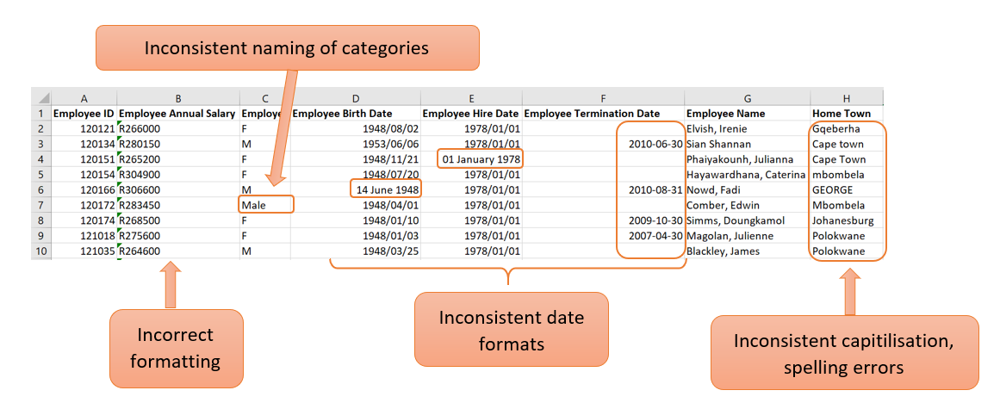
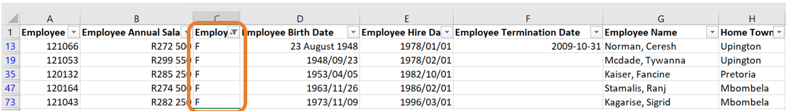
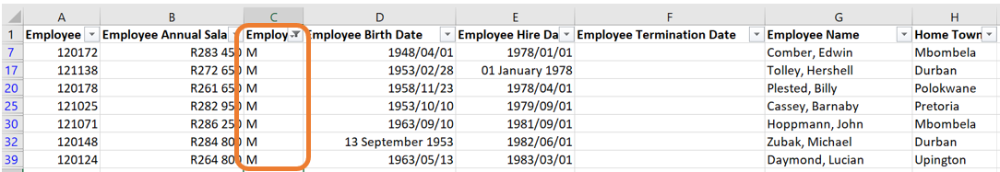
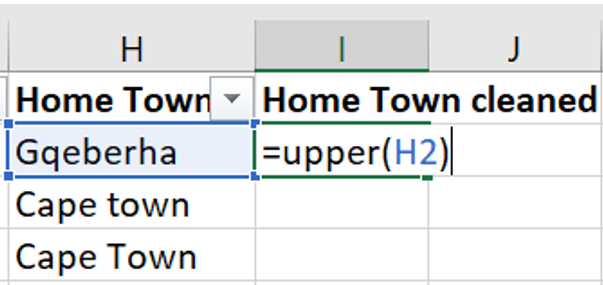
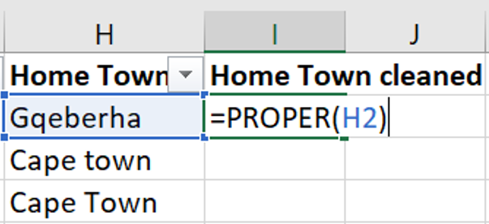
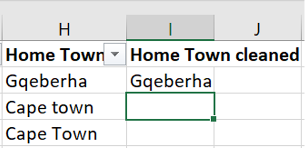

---
output:
  html_document: default
---

# Data Handling in Excel{#ch3}

In this chapter, you will be introduced to some of the fundamental skills needed to work with data in Excel. Excel is a powerful tool enabling us to organise, analyse and visualise data efficiently. This chapter will not only enhance your ability to manage data but also lay the foundation for the more advanced data analysis. 

Topics covered in this chapter includes:

- Data importing

- Data cleaning

- Data manipulation

## Data importing

In this subsection, the focus is on importing data into Excel from different sources such that we can start working with it. This is a crucial first step when doing data analysis.

### Change decimal separator settings in Excel

On most devices, the default setting in Excel is to use a comma as a decimal separator. This causes some difficulties especially when working with .csv (comma separated value) files.

\newpage

1. Go to the **File** tab.

```{r, echo = FALSE, out.width='60%',fig.align='center'}

```

2. At the bottom of the menu at the left, select **More...** and then **Options**.

```{r, echo = FALSE, out.width='60%',fig.align='center'}
knitr::include_graphics("Figures/Decimal_step2.png")
```

3.  The Excel Options window will open. Select **Advanced** on the menu at the left.

```{r, echo = FALSE, out.width='60%',fig.align='center'}
knitr::include_graphics("Figures/Decimal_step3.png")
```


4.  Under **Editing Options** there is a you can specify the **Decimal separator**. In the box, make sure to have a full stop (`.`) instead of a comma (`,`).

```{r, echo = FALSE, out.width='60%',fig.align='center'}
knitr::include_graphics("Figures/Decimal_step4.png")
```

5.  Click **OK** to save the changes.

### Opening a .xlsx file in Excel

A file with the `.xlsx` extension is a standard Excel file. Such files can be opened in Excel effortlessly. The following steps can be followed:

1. Go to the **File** tab.

```{r, echo = FALSE, out.width='60%',fig.align='center'}

```


\newpage

2. Select **Open**.

```{r, echo = FALSE, out.width='60%',fig.align='center'}
knitr::include_graphics("Figures/import_open_1.png")
```

3. Click on **Browse**.

```{r, echo = FALSE, out.width='60%',fig.align='center'}
knitr::include_graphics("Figures/import_open_2.png")
```

4. Navigate to the location of the file you want to import and select it.

### Importing a .txt file in Excel

Some external programs can export data in a text (`.txt`) file. If you wish to do some data manipulation or work with the data in any other way, you will need to import the text file in Excel. 

When data is stored in a text file, various symbols (known as delimiters) are used to indicate the separation between columns. These delimiters help structure the data so that tools like Excel or programming languages can interpret it accurately. Here’s an explanation of common delimiters used in text files:

\newpage

1. Tabs

```{r, echo = FALSE, out.width='40%',fig.align='center'}
knitr::include_graphics("Figures/import_tabs.png")
```

2. Commas

```{r, echo = FALSE, out.width='40%',fig.align='center'}
knitr::include_graphics("Figures/import_commas.png")
```

3. Semicolons

```{r, echo = FALSE, out.width='40%',fig.align='center'}
knitr::include_graphics("Figures/import_semicolon.png")
```

4. Pipes

```{r, echo = FALSE, out.width='40%',fig.align='center'}

```

#### Example

You have obtained access to a data set available exclusively in text format, named `SACensus2022-Data-Text.txt`. To work with this data set, you need to import it into Excel. Follow these steps to complete the process:

1. Open Excel and navigate to the **Data** tab. In the **Get/Transform Data** group click the **From Text/CSV** button.

```{r, echo = FALSE, out.width='70%',fig.align='center'}
knitr::include_graphics("Figures/import_1.png")
```

\newpage

2. A file selection window will appear. Navigate to the location of the file you want to import and select it. By default, the dropdown menu at the bottom right will show "Text Files (`.txt`, `.csv`)" as the file type. Ensure this option is selected.

```{r, echo = FALSE, out.width='60%',fig.align='center'}

```

3. The Import Wizard will open in Excel. Check that the data columns are separated correctly. Excel typically detects the delimiter (e.g., commas, tabs) automatically, but you can change it using the dropdown menu at the top of the wizard if needed.

```{r, echo = FALSE, out.width='70%',fig.align='center'}

```

\newpage

4. Click **Load** to import the data into a new worksheet. The data will now be displayed in Excel, ready for use.

```{r, echo = FALSE, out.width='70%',fig.align='center'}
knitr::include_graphics("Figures/import_4.png")
```

**NOTE:** The same process can be followed to open a `.csv` file in Excel. In the case where the settings for the decimal separator is correct, a `.csv` file can be opened using \textit{File > Open > Browse} and selecting the desired file. 

### Importing data from a website

It is also possible to import a data table into Excel directly from a website, saving you the effort to manually retype the information you need. 

Suppose you need to compile a list of all the districts in South Africa. You found such a list on Wikipedia and want to import it into Excel. Follow these steps:

1. Open Excel and navigate to the **Data** tab. In the **Get & Transform Data** group click the **From Web** button.

```{r, echo = FALSE, out.width='70%',fig.align='center'}
knitr::include_graphics("Figures/web_1.png")
```

\newpage

2. In the **From Web** wizard, paste the URL of the website containing the table you want to import, then click **OK**.

```{r, echo = FALSE, out.width='60%',fig.align='center'}

```

3. Next the **Navigator** window will open. On the left-hand side, you will see a list of tables available from the webpage. Click on a table name to preview the contents of the table on the right-hand side. Select the correct table you want to import. Click on **Load** to import the table into your Excel worksheet.

```{r, echo = FALSE, out.width='70%',fig.align='center'}
knitr::include_graphics("Figures/web_3.png")
```

Alternatively, the **From Web** wizard can be accessed using the **GetData** button in the **Get & Transform Data** group. 

```{r, echo = FALSE, out.width='60%',fig.align='center'}
knitr::include_graphics("Figures/Section3-1.png")
```

## Data cleaning

Data cleaning is an essential process of identifying and correcting inconsistencies and inaccuracies within a dataset. This process improves the quality, accuracy and reliability for the data. In fact, a data analyst spends a lot of time on preparing the data for analysis. It is very rare that the raw data is in the correct format and without any errors.

Data cleaning is the process of transforming raw data into consistent data that can be analysed. 

To ensure that the data set is cleaned and refined before starting an analysis is crucial to assure that the analysis is accurate and therefore that better-informed decisions can be deduced from the analysis. When statistical analysis is performed on data that isn't properly cleaned, the integrity of the results and findings are compromised and not trustworthy.

Therefore, the analysis is only as reliable as the data that is used for the analysis, making data cleaning an essential step.

The specific data cleaning techniques that one will use always depends on the application at hand and the analysis needed. Here is a list of some data cleaning techniques:

-   Removing the data that is not necessary for your analysis.

-   Identifying and removing observations that are duplicated.

-   Correcting typing errors, errors in capitalisations or inconsistent naming conventions.

-   Removing or imputing missing data.

-   Encoding categorical data either to or from a numerical format.

-   Ensuring that the data is in a consistent format.

### Example: Data cleaning in Excel

You are given a data set containing information on employees working at Orion Sales. This data set is named `orion_sales_staff.xlsx`. Once you have opened the data set in Excel, you come across some problems with the data set that requires data cleaning.

```{r, echo = FALSE, out.width='70%',fig.align='center'}

```

#### Correct the formatting of a cell {.unnumbered .unlisted}

In the example above, the values in the "Employee Annual Salary" column are seen as text. This is clearly visible with the left alignment of the values in the cell. Because annual salary is a numerical value, the formatting needs to be corrected so that Excel can handle the values as numbers.

This can be corrected with the following steps:

1.  If you click in the cell, there will be a yellow block with an exclamation mark on the left.

```{r, echo = FALSE, out.width='40%',fig.align='center'}
knitr::include_graphics("Figures/cleaning_formatting_1.png")
```

2. By clicking on the warning sign, a dropdown list will open where you can choose the option “Convert to Number”. 

```{r, echo = FALSE, out.width='40%',fig.align='center'}
knitr::include_graphics("Figures/cleaning_formatting_2.png")
```

3.  Now the cell's formatting will be corrected. This can be seen by the value being right aligned within the cell. 

```{r, echo = FALSE, out.width='40%',fig.align='center'}
knitr::include_graphics("Figures/cleaning_formatting_3.png")
```

4. To do this for an entire column, The same procedure can be followed by highlighting all the cells that need to be changed.

This process will automatically change the format of the cells from text to “currency”. If you work with this data set in Excel, this formatting will be sufficient as Excel knows how to work with this. If the data set is imported into another statistical program (which you will be familiarised later on), the format of this column needs to be “Number” instead of “Currency”. 

This can be done by navigating to the “Number” group on the Home tab in Excel and opening the dropdown list. From this dropdown list, the appropriate formatting can be selected which is "Number" in this case.

```{r, echo = FALSE, out.width='40%',fig.align='center'}
knitr::include_graphics("Figures/cleaning_formatting_4.png")
```


#### Inconsistent naming of categories {.unnumbered .unlisted}

In column C of the example above, the categories are not named consistently. This column consists of the gender of each employee. By glancing at the screenshot of the first few lines of the data, it can be seen that the categories are labelled as "M" (for male) and "F" (for female). However, in line 7, the entry is "Male". There can be more occurrences like this further in the data. Having inconsistent naming of categories is not ideal as this will cause problems when you start to work with the data. For example, when constructing frequency tables or barplots. 

This can be corrected with the following steps:

1. Select all the columns of the data set. In the "Editing" group on the "Home" tab, click on "Sort & Filter" and then on "Filter. This will allow you to filter the data by a specific column.

```{r, echo = FALSE, out.width='70%',fig.align='center'}
knitr::include_graphics("Figures/cleaning_categories_1.png")
```

2. The filter icon will now be next to each column name. When clicking on the item next to the column name you would like to filter on, a menu will open up. On this menu, you have the ability to sort the data by this column or filter certain categories. In the screenshot below, all the categories are ticked meaning that all the observations of the data set will be displayed. In the example below, it can be seen that there are categories named "M", "F", "Male" and "Female". We would like to change all the observations with category "Female" to "F" and all the observations with category "Male" to "M".

```{r, echo = FALSE, out.width='40%',fig.align='center'}
knitr::include_graphics("Figures/cleaning_categories_2.png")
```

3. When removing the tick marks of all the categories except one, only the observations from the specific category will be displayed. In our case, let us first filter all the observations where the gender is indicated as "Female".

```{r, echo = FALSE, out.width='70%',fig.align='center'}
knitr::include_graphics("Figures/cleaning_categories_3.png")
```

4. Having all the observations filtered out, you can manually change the categories to "F".

```{r, echo = FALSE, out.width='70%',fig.align='center'}

```

5. The came can be done for the males. Again, click on the filter icon next to the column name. Remove the tick marks of all the categories except the one with "Male".

```{r, echo = FALSE, out.width='70%',fig.align='center'}
knitr::include_graphics("Figures/cleaning_categories_5.png")
```

6. Then, manually change the categories to "M". 

```{r, echo = FALSE, out.width='70%',fig.align='center'}

```

#### Inconsistent capitalisations {.unnumbered .unlisted}

In the column named "Home Town", there are a few observations where the name of the town is written in all capital letters, all small letters or the second word is written with a small letter instead of a capital letter. 

The best and quickest way to correct this is to create a new column and use built-in Excel functions to do the correction. Let us call this column "Home Town cleaned". 

Next, we will introduce three new functions that will alter how the names of the towns are written. 

\newpage

1. The first function is `=UPPER()`. This function will return the word in the selected cell written in all capital letters. 

```{r, echo = FALSE, out.width='40%',fig.align='center'}

```

```{r, echo = FALSE, out.width='40%',fig.align='center'}
knitr::include_graphics("Figures/capitals_2.png")
```

2. The second function is `=LOWER()`. This function will return the word in the selected cell written in all lower case letters. 

```{r, echo = FALSE, out.width='40%',fig.align='center'}
knitr::include_graphics("Figures/capitals_3.png")
```

```{r, echo = FALSE, out.width='40%',fig.align='center'}
knitr::include_graphics("Figures/capitals_4.png")
```

3. The third function is `=PROPER()`. This function will return the word in the selected cell where the first letter of each word is written in a capital letter followed by lower case letters. 

```{r, echo = FALSE, out.width='40%',fig.align='center'}

```

```{r, echo = FALSE, out.width='40%',fig.align='center'}

```

In the same column, some of the town names are misspelled. This can be corrected similarly to how you corrected the inconsistencies in the category names. 

#### Correcting the date format {.unnumbered .unlisted}

The columns "Employee Birth Date", "Employee Hire Date" and "Employee Termination Date" are examples of columns containing dates. 

The dates can be corrected by selecting all the columns containing dates, then selecting the "short date" format on the drop-down list in the "Number" group on the "Home tab.

```{r, echo = FALSE, out.width='40%',fig.align='center'}
knitr::include_graphics("Figures/dates.png")
```

### Missing data

Missing data occurs when there is no value for a variable of a certain observation. This is a common issue in data analysis and can arise for various reasons. Missing data can have a significant effect on data analysis and conclusions drawn from such analysis. 

Missing data often results from non-response. For example, in a survey, a respondent may leave a question unanswered. This usually happens in the case of sensitive information such as salary. Another reason for missing data is caused by errors made by the researcher during data collection or entry.

**Types of missing data:**

- **Missing completely at random (MCAR)**: With this type of missing data, the probability of an observation being missing is entirely random and independent of any other variable in the data set. For example, at the end of a customer service call, customers might be asked to complete a satisfaction survey. Some individuals may choose not to respond which causes missing data.

- **Missing at random (MAR)**: With this type of missing data, the probability of an observation being missing depends on the values of other variables in the data set but not the missing variable itself. For example, after visiting a dermatology clinic, customers might be asked to fill in a survey on their gender and skincare routine. If females are more likely to respond, the missing data can be explained by the gender of the individual.

- **Missing not at random (MNAR)**: With this type of missing data, the probability of a data point being missing is related to the missing value itself. For example, some individuals might prefer not to answer sensitive information on a survey such as their salary.

**Some methods for handling missing data:**

- **Imputation**: In some cases, the missing data can be replaced with estimated values. Some common approaches include filling in missing values with the mean, median or mode of the variable.

- **Interpolation**: This method of handling missing data is to fill in missing data based on the adjacent datapoints. This is a popular method to use in time series data.

- **Deletion**: In some cases, it may be appropriate to remove the variable entirely from the analysis when the variable has a high proportion of missing values. Another method is to delete an entire observation if one or more of the variables contains missing data. 

- **Model-based approaches**: With this method predictive models are used to impute the missing values in the data set based on other variables in the data set.

When working with data that contains missing values, caution should always be taken. The type of missing data as well as the analysis at hand should guide the data analyst on how to handle the missing data. 

#### Example

You are given a data set called `Diabetes Missing Data.xlsx` which contains vital measurements of 30 patients. Some of the data is missing and you are required to explore this in Excel. 

```{r, echo = FALSE, out.width='80%',fig.align='center'}
knitr::include_graphics("Figures/missing.png")
```

#### Filter a column for missing values {.unnumbered .unlisted}

Missing values can be represented in various ways, such as `NA`, `N/A` or as a blank cell. 

In this example, we will filter the `Diastolic_BP` column to display only the observations with missing values for this variable. Follow these steps:

\newpage

1. Select all the columns of the data set. In the **Editing** group on the **Home** tab, click on **Sort & Filter** and then on "Filter". This will allow you to filter the data by a specific column.

```{r, echo = FALSE, out.width='80%',fig.align='center'}

```

2. Click on the Filter icon next to the column name which will open up a menu. Untick all the tick boxes except the one labelled "(blank)". Then click OK.

```{r, echo = FALSE, out.width='40%',fig.align='center'}
knitr::include_graphics("Figures/missing_1_2.png")
```

\newpage

3. This will then only display the observations with a missing value for this variable.

```{r, echo = FALSE, out.width='80%',fig.align='center'}
knitr::include_graphics("Figures/missing_1_3.png")
```

#### Use conditional formatting to highlight cells with missing values {.unnumbered .unlisted}

In the case where you simply want to highlight the cells with missing values, conditional formatting can be used. For this example, we will highlight the missing values in the `Skin_Fold` variable. Follow these steps:

1. Select the column on which you want to apply the conditional formatting. Navigate to the **Home** tab, click on **Conditional Formatting** and choose **New Rule**.

```{r, echo = FALSE, out.width='80%',fig.align='center'}

```

\newpage

2. In the New Formatting Rule dialog box, select **Format only cells that contain**. Then at the dropdown menu under **Format only cells with:**, select "Blanks". By clicking on the **Format** button, you can specify the formatting style for the highlighted cells.

```{r, echo = FALSE, out.width='40%',fig.align='center'}
knitr::include_graphics("Figures/missing_2_2.png")
```

3. As a result, all the cells with missing values will be highlighted.

```{r, echo = FALSE, out.width='80%',fig.align='center'}
knitr::include_graphics("Figures/missing_2_3.png")
```

#### Find and replace missing values {.unnumbered .unlisted}

When you want to replace all the missing values of a certain variable with the same value, **Find & Replace** can be used. In this example, replace all the missing values from the `Serum_Insulin` variable with the word "Missing". Follow the following steps:

\newpage

1.  Select the desired column. Navigate to the **Home** tab, click on **Find & Select** and choose **Replace**.

```{r, echo = FALSE, out.width='80%',fig.align='center'}
knitr::include_graphics("Figures/missing_3_1.png")
```

2. In the Find & Replace dialog box, leave the **Find what** field blank to target all blank cells. Enter the word "Missing" in the **Replace with** field. Click on **Replace All** to apply this change to the entire column.

```{r, echo = FALSE, out.width='50%',fig.align='center'}

```

3. As a result, all the cells that were empty previously will now contain the word "Missing".

```{r, echo = FALSE, out.width='80%',fig.align='center'}

```

### Duplicate values

When working with a real-world data set, you may encounter duplicated records. Such records do not provide additional information and can slow down the analysis process or lead to inaccuracies.  Therefore, it is best to remove such observations.

To remove duplicated rows in Excel, the following steps can be followed:

1. Select the entire data set in Excel. Navigate to the **Data** tab and in the **Data Tools** group, click on the **Remove Duplicates** icon.

```{r, echo = FALSE, out.width='80%',fig.align='center'}
knitr::include_graphics("Figures/duplicated_1.png")
```

2. In the Remove duplicates dialog box, you can select the columns where duplicates should be identified. In most cases, it will be appropriate to select all the columns to ensure rows are entirely unique. Click **OK** to remove all the duplicates.

```{r, echo = FALSE, out.width='40%',fig.align='center'}

```

### Exercises

1. Explain why data cleaning is an essential step for the analysis.

2. What are the common types of issues that you can encounter in a real-word data set? 

3. Why is it necessary to remove duplicate records? 

4. List some data cleaning techniques and provide an example of where such technique might be necessary.

5. Name the functions in Excel that can be used to change the capitilisation of words in Excel.

6. Why is it important to standarise text entries (for example, converting "Yes" and "yes" to the same format) in a data set? Can you think of an example where inconsistencies in text entries can affect analysis?

7. What are some common reasons for missing data in a data set? Provide some examples of where missing data occurs.


## Data manipulation

Data manipulation is the process of adjusting data so that it is easier to work with and more organised. Data manipulation is a crucial part of the analytical process because it allows statisticians to prepare data in a format that meets the requirements of specific analyses. The specific data manipulation needs depends on the application at hand as well as the statistical analysis that is required. Proper data manipulation enhances the interpretability of data, ensures accuracy in computations, and enables the effective application of statistical methods. Without it, raw data might obscure patterns, relationships, and insights that are vital for informed decision-making.

Data manipulation may include the following:

- Removing the data that is not necessary for your analysis.

- Identifying and removing rows that are duplicated.

- Encoding categorical data either to or from a numerical format.

- Conditional formatting in Excel.

- Combining data sets.

- Splitting and combining columns. 

- Pivot tables in Excel to reshape the data set.

### Example: Super Animals

A few years ago, the Super Animal Cards were available at Pick n Pay stores. These collectible cards feature illustrations and fascinating facts about various animals. The aim was to spark curiosity and environmental awareness among children. Each card highlights a different animal's unique characteristics, habitat and conservation status. 


```{r echo = FALSE, warning = FALSE, message=FALSE}
library(knitr)
```


```{r echo=FALSE, out.width="40%", fig.show='hold', fig.align='center'}
include_graphics(c("Figures/super-animals.png","Figures/super-animals2.png"))
```


The information from these cards are collected in a data set called `super-animals.xlsx`.

#### The VLOOKUP function {.unnumbered .unlisted}

The VLOOKUP function in Excel is a powerful tool to make data more descriptive and meaningful by referencing values from another table. In this example, the conservation status of animals is initially indicated with numeric values (1, 2, 3, and 4) in the dataset. To make this information more interpretable, we use a lookup table containing the corresponding descriptions for each number:

```{r echo = FALSE, results='asis', warning = FALSE, message = FALSE}
library(kableExtra)

cons <- data.frame(Indicator = c(1,2,3,4),
                   Description = c("Critically Endangered (CR)", "Vulnerable (VU)", "Near Threatened (NT)", "Least Concern (LC)"))

cons %>%
  kbl() %>%
  kable_classic(full_width = F)
```

By replicating the lookup table in a separate sheet of the Excel file, the VLOOKUP function can map the numeric indicators to their corresponding descriptions. This method not only improves clarity but also allows for easier data analysis and reporting, making it a practical approach to handle coded information in datasets.

The syntax for the VLOOKUP function is:

`=VLOOKUP(lookup_value, table_array, col_index_num, [range_lookup])`

- `lookup_value`: The value you want to search for in the first column of the table.

- `table_array`: The range of cells containing the table, including the column with the lookup value and the column with the return value.

- `col_index_num`: The column number (relative to the table) from which to retrieve the result.

- `range_lookup (optional)`: Specifies whether the match should be exact (`FALSE`) or approximate (`TRUE`). By default, it's approximate.

In this example, the process of using the VLOOKUP function to map descriptive conservation statuses to numeric indicators involves the following steps:

1. Begin by entering the lookup table in a separate sheet within the Excel file. This table should contain the numeric indicators in one column and their corresponding descriptions in another.

```{r echo=FALSE, out.width="30%", fig.align='center'}
include_graphics("Figures/manipulation_1_lookup.png")
```

2. In a new column of your dataset, type the VLOOKUP formula to reference the lookup table. Ensure you use absolute cell references (with dollar signs, e.g., `$A$1:$B$5`) for the lookup table range. This prevents the table reference from shifting when you drag the formula down to apply it to other rows.

```{r echo=FALSE, out.width="70%", fig.align='center'}

```

#### Conditional formatting {.unnumbered .unlisted}

Conditional formatting is a tool in Excel that allows users to automatically apply formatting to certain cells based on specified criteria. The formatting can be colours, icons, or many others. You can create rules based on predefined options or custom formulas. 

In the example of the Super Animal Cards, conditional formatting can be used to highlight the top 10 animals with the highest weights. This is particularly useful for quickly identifying the heaviest animals in the data set. To achieve this in Excel:

1. Select the column containing the weight data.

```{r, echo=FALSE, out.width='70%', fig.align='center'}
include_graphics("Figures/manipulation_2_1.png")
```

\newpage 

2. Navigate to the **Home** tab, click on **Conditional Formatting** and choose **New Rule**.

```{r, echo=FALSE, out.width='30%', fig.align='center'}
include_graphics("Figures/manipulation_2_2.png")
```

3. In the New Formatting Rule dialog box, select **Format only top or bottom ranked values**. This allows you to target the top 10 entries in the dataset.

```{r, echo=FALSE, out.width='40%', fig.align='center'}
include_graphics("Figures/manipulation_2_3.png")
```

\newpage

4. Specify the formatting style, such as a bold font or a shaded cell color, to visually emphasise the top 10 entries.

```{r, echo=FALSE, out.width='40%', fig.align='center'}
include_graphics("Figures/manipulation_2_4.png")
```


#### Numerical calculations in Excel {.unnumbered .unlisted}

Excel can also perform basic numerical calculations, such as addition, subtraction, multiplication, and division. These operations can be executed directly in cells using simple formulas:

- Addition: `= A1 + B1` adds the values in cells A1 and B1.

- Subtraction: `= A1 - B1` subtracts the value in cell B1 from the value in cell A1.

- Multiplication: `= A1 * B1` multiplies the values in cells A1 and B1.

- Division: `= A1 / B1` divides the value in cell A1 by the value in cell B1.

These formulas can also combine multiple operations using parentheses for clarity and order of precedence. For example, `= (A1 + B1) * C1` first adds the values in cells A1 and B1, then multiplies the result by the value in cell C1.

In the example of the Super Animal Cards, we can convert the speed from kilometers per hour to miles per hour by multiplying the values in column H with 0.621371.

```{r, echo=FALSE, out.width='70%', fig.align='center'}
include_graphics("Figures/manipulation_3_1.png")
```

#### Constructing crosstabulations {.unnumbered .unlisted}

The PivotTable tool in Excel is a powerful feature for constructing crosstabulations involving two or more variables. In this example, we will consider two cases: 

1. When both variables are categorical.

2. When one variable is categorical and the other is numerical. 

-  **Case 1: Create a crosstabulation of the species and the category of the super animal card.**

  1. Navigate to the **Insert** tab and select **PivotTable**. 
```{r, echo=FALSE, out.width='80%', fig.align='center'}
include_graphics("Figures/pivot_1.png")
```
  
\newpage
  
  2. The Create PivotTable wizard will appear, where you can review the data range that is automatically detected and choose where the PivotTable will be created. For this example, select **New Worksheet**. Click **OK**.
  
```{r, echo=FALSE, out.width='60%', fig.align='center'}

```
  
  3. A new worksheet will open up with the PivotTable Fields on the right. 
  
```{r, echo=FALSE, out.width='80%', fig.align='center'}

```
  
\newpage
  
  4. Using the PivotTable Fields menu, the Pivot Table can be set up. Drag the column headings to their desired positions. Drag "Category" to the Rows area. Drag "Species" to the Columns area. Drag "Animal" to the Values area to count the number of animals in each category.
  
```{r, echo=FALSE, out.width='80%', fig.align='center'}

```
  
- **Case 2: Create a crosstabulation of the Species and the Size of the animal.** 

  1. Create the Pivot Table as in steps 1 and 2 above.
  
  2. Drag the column headings to their desired positions. Drag "Species" to the Rows area. Drag "Size" to the Columns area. Drag "Animal" to the Values area.
  
```{r, echo=FALSE, out.width='80%', fig.align='center'}
include_graphics("Figures/pivot_5.png")
```
  
  3. Since "Size" is a numerical variable, it must be grouped into ranges. This can be done by selecting the cell with the first value of the "Size" variable, right-click and select **Group** from the menu. 
  
```{r, echo=FALSE, out.width='60%', fig.align='center'}

```
  
  4. In the Grouping window, specify the desired range settings.
  
```{r, echo=FALSE, out.width='40%', fig.align='center'}
include_graphics("Figures/pivot_7.png")
```
  
  5. The PivotTable will now display a neater and more interpretable corsstabulation for species by grouped sizes.
  
```{r, echo=FALSE, out.width='80%', fig.align='center'}

```

### Example: Employees

You are employed as a data analyst for a company and have been provided with a data set containing details about employees and the projects they are working on. 

```{r, echo=FALSE, out.width='80%', fig.align='center'}

```

In this example, we will illustrate how to:

- Combine two columns in Excel into one.

- Splitting one column into two columns.

#### Combining columns {.unnumbered .unlisted}

To combine the information of two columns into one, we will make use of the `CONCAT` function. This function is used in Excel to join, or concatenate, two or more text strings into a single string. In this example, we will join the name and the surname of the employees into a single column. The syntax for the `CONCAT` function is:

`=CONCAT(text1, [text2], ...)`

where `text1, text2,...` are text strings, cell references or ranges to be combined separated by commas. It is important to note that the `CONCAT` function does not automatically add any deliminators such as spaces or commas between the text strings. This must be explicitly added as part of the list of arguments. 

For this example, if we want to combine the text in the "emp_name" and "emp_surname" variables, the following steps can be followed:

\newpage

1. Insert an empty column where the combined variable will be placed. To do this, select the column where the new column should appear before, right-click and select **Insert** from the menu. This will create an empty column which you can name "emp_name_surname".

```{r, echo=FALSE, out.width='60%', fig.align='center'}

```


2. In the first cell of the new column, use the `CONCAT` function to combine the name of the employee (in column B) with their surname (in column C). Remember to add a space between the name and the surname! 

```{r, echo=FALSE, out.width='80%', fig.align='center'}
include_graphics("Figures/combine_3.png")
```


3. The result of the `CONCAT` function is as follows:

```{r, echo=FALSE, out.width='80%', fig.align='center'}

```


4. Copy the formula down the rest of the columns to combine the names and the surnames for all the employees in the data set.

```{r, echo=FALSE, out.width='80%', fig.align='center'}
include_graphics("Figures/combine_5.png")
```


#### Splitting columns {.unnumbered .unlisted}

To split columns in Excel, the **Text to Columns** functionality can be used. This functionality is used to split data in a single column into multiple columns based on either a specific deliminator or a fixed width. This is particular useful when the combined data needs to be separated into distinct fields for easier analysis or formatting. 

For this example, the project name and the client name are displayed in a single column, separated by a semicolon (`;`). To split them into two columns, follow these steps:

1. Again, add an empty column next to the column which requires splitting. Then, select the column with the combined information. Navigate to the **Data** tab and select **Text to columns**.

```{r, echo=FALSE, out.width='80%', fig.align='center'}
include_graphics("Figures/split_1.png")
```

2. The Convert Text to Columns Wizard will open. In this case, the data is "Delimited" because the information is separated with a semicolon. This is often automatically detected. Click **Next**.

```{r, echo=FALSE, out.width='60%', fig.align='center'}
include_graphics("Figures/split_2.png")
```

\newpage

3. In the next step, select the appropriate deliminator, in this case, "semicolon". You can preview the split data in the "Data Preview" section to confirm the results. Click **Next**.

```{r, echo=FALSE, out.width='60%', fig.align='center'}
include_graphics("Figures/split_3.png")
```

4. In the final step, choose the data format for each column. For this example, you can keep the default settings. Click **Finish**.

```{r, echo=FALSE, out.width='60%', fig.align='center'}
include_graphics("Figures/split_4.png")
```

5. To combined data will now be split into two separate columns: one for the project name and one for the client name.

```{r, echo=FALSE, out.width='80%', fig.align='center'}
include_graphics("Figures/split_5.png")
```

### Basic Excel functions

Excel has many built-in functions that can assist in doing more numerical calculations, creating new variables in a data set as well as summarising data. 

#### Summation {.unnumbered .unlisted}

The `SUM` function can be used to calculate the total of a range of numbers. The syntax for the `SUM` function is:

`=SUM(number1, number2, ...)` or `=SUM(range)`

For example, `SUM(A1:A10)` will return the sum of all the numbers in cells A1 to A10.

#### Averaging {.unnumbered .unlisted}

The arithmetic mean of a range of values can be calculated with the `AVERAGE` function. The syntax for the `AVERAGE` function is:

`=AVERAGE(number1, number2, ...)` or `=AVERAGE(range)`

For example, `AVERAGE(A1:A10)` will return the average of all the numbers in cells A1 to A10.

#### Counting {.unnumbered .unlisted}

Counting functions can be useful for analysis the structure of the data set. Here we will consider three counting functions popularly used in Excel:

- The `COUNT` function counts the number of cells containing a numerical value. The syntax for the `COUNT` function is:

`=COUNT(value1, value2, ...)` or `=COUNT(range)`

For example, `COUNT(A1:A10)` will return the number of cells containing a numerical value in cells A1 to A10.

- The `COUNTA` function counts the number of non-empty cells. The cells can contain numerical values, text or values from any other data type. The syntax for the `COUNTA` function is:

`=COUNTA(value1, value2, ...)` or `=COUNTA(range)`

For example, `COUNTA(A1:A10)` will return the number of non-empty cells in the range A1 to A10.

- The `COUNTBLANK` function counts the number of empty cells. The syntax for the `COUNTBLANK` function is:

`=COUNTBLANK(value1, value2, ...)` or `=COUNTBLANK(range)`

For example, `COUNTBLANK(A1:A10)` will return the number of empty cells in the range A1 to A10.

#### Minimum and maximum values {.unnumbered .unlisted}

The `MIN` and `MAX` functions can be used to identify the smallest and the largest value in a range. The syntax for the `MIN` and the `MAX` functions is:

- `=MIN(number1, number2, ...)` or `=MIN(range)`

- `=MAX(number1, number2, ...)` or `=MAX(range)`

For example, `MIN(A1:A10)` will return the smallest value in the range A1 to A10 and `MAX(A1:A10)` will return the largest value in the range A1 to A10.

#### IF function {.unnumbered .unlisted}

The `IF` function performs a logical test and returns one value if the condition is true and another value if the condition is false. The syntax for the `IF` function is:

`=IF(logical_test, value_if_true, value_if_false)`

- `logical_test`: Any value or expression that can be evaluated to TRUE or FALSE.

- `value_if_true`: The value that is returned if `logical_test` is TRUE.

- `value_if_false`: The value that is returned if `logical_test` is FALSE.

For example, `=IF(A1>50, "Pass", "Fail")` will return "Pass" if the value in cell A1 is greater than 50; otherwise it will return "Fail".

#### Countif function {.unnumbered .unlisted}

The number of cells than meet a certain condition can be counted with the `COUNTIF` function. The syntax for the `COUNTIF` function is:

`COUNTIF(range, criteria)`

- `range`: The range of cells from which you want to count non-empty cells.

- `criteria`: The condition in the form of a number, expression or text that defines which cells will be counted.

For example, `=COUNTIF(A1:A10, ">10")` will count all the cells from A1 to A10 which contains a numerical value greater than 10.

#### Sumif function {.unnumbered .unlisted}

The `SUMIF` function is used to sum the values in a range that meets a specified criteria. The syntax for the `SUMIF` function is:

`=SUMIF(range, criteria, [sum_range])`

- `range`: The range of cells you want to evaluate.

- `criteria`: The condition or criteria in the form of a number, expression or text that defines which cells will be added.

- `sum_range` (optional): The actual cells to sum. If this argument is not specified, the cells in `range` will be used.

For example, suppose you have a data set with two columns, where column A contains the product category and column B contains the number of sales.

- To sum the sales for "Electronics", you can use the formula:

`=SUMIF(A1:A10, "Electronics", B1:B10)`

where Excel will look for the word "Electronics" in the range A1 to A10 and the corresponding sales values in B1 to B10 will be summed.

- To sum all the sale values greater than 500, you can use the formula:

`=SUMIF(B1:B10, ">500")`

where Excel will sum all the sales values greater than 500 in the range B1 to B10.

#### Absolute cell referencing {.unnumbered .unlisted}

In Excel, you can use absolute cell referencing to ensure that the formula keeps referencing to the same cell or range of cells regardless or where the formula is copied or moved. The syntax for absolute cell referencing is: `$Column$Row`. For example, `$A$1` refers to cell A1 and this reference will not change regardless of where the formula is copied in the Excel sheet.

Absolute cell referencing is useful in scenarios where you need to repeatedly reference the same cell or range of cells. Common examples include:

- **Using a constant value**: When applying a discount stored in a specific cell across multiple calculations. 

- **Referencing a total**: Referring to a grand total cell in calculations. 

### Exercises

1. Describe a scenario where you might use the **Text to Columns** functionality in Excel.

2. Explain the difference between using a delimiter and using fixed width in the **Text to Columns** tool. Provide examples for each.

3. What is the difference between `COUNT`, `COUNTA`, and `COUNTBLANK` functions? Provide an example for each.

4. You are analysing sales data, and the column containing the product names has been combined with the client names, separated by a comma. Describe how you would use Excel to split this column into two separate columns.

5. Explain how the `CONCAT` function can be used to combine data from two columns. Provide an example of when this might be useful.

6. Explain the importance of absolute cell referencing in Excel. Provide an example of when it would be necessary.

7. Describe a situation where combining data from two separate columns would be helpful for analysis. Which function in Excel would you use, and why?


