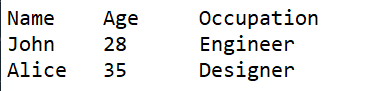
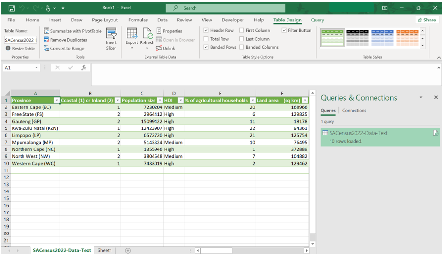
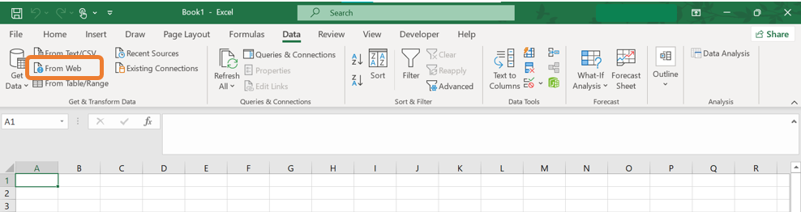
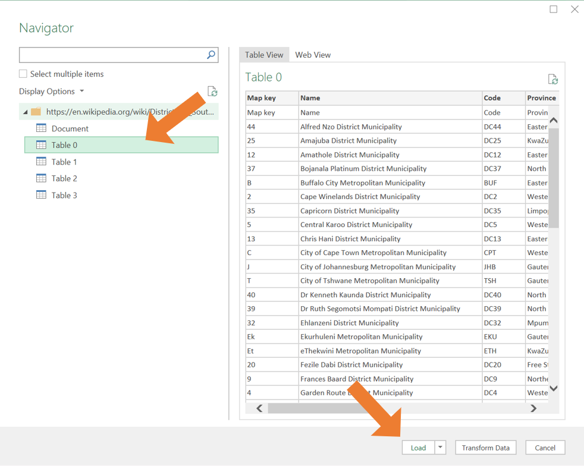

# Data importing{#ch2}

## Change decimal separator settings in Excel

On most devices, the default setting in Excel is to use a comma as a decimal separator. This causes some difficulties especially when working with .csv (comma separated value) files.

1.  Go to the **File** tab.

```{r, echo = FALSE, out.width='50%',fig.align='center'}
knitr::include_graphics("Figures/decimal_step1.png")
```

2.  At the bottom of the menu at the left, select **More...** and then **Options**.

```{r, echo = FALSE, out.width='50%',fig.align='center'}
knitr::include_graphics("Figures/Decimal_step2.png")
```

3.  The Excel Options window will open. Select **Advanced** on the menu at the left.

```{r, echo = FALSE, out.width='50%',fig.align='center'}
knitr::include_graphics("Figures/Decimal_step3.png")
```


4.  Under **Editing Options** there is a you can specify the **Decimal separator**. In the box, make sure to have a full stop (`.`) instead of a comma (`,`).

```{r, echo = FALSE, out.width='50%',fig.align='center'}
knitr::include_graphics("Figures/Decimal_step4.png")
```

5.  Click **OK** to save the changes.

## Opening a .xlsx file in Excel

A file with the .xlsx extension is a normal Excel file. Such files can easily be opened in Excel without any problems. The following steps can be followed:

1. Go to the **File** tab.

```{r, echo = FALSE, out.width='50%',fig.align='center'}
knitr::include_graphics("Figures/decimal_step1.png")
```

2. Select **Open**.

```{r, echo = FALSE, out.width='50%',fig.align='center'}
knitr::include_graphics("Figures/import_open_1.png")
```

3. Click on **Browse**.

```{r, echo = FALSE, out.width='50%',fig.align='center'}
knitr::include_graphics("Figures/import_open_2.png")
```

4. Navigate to the location of the file you want to import and select it.

## Importing a .txt file in Excel

Some external programs can export data in a text (.txt) file. If you wish to do some data manipulation or work with the data in any other way, you will need to import the text file in Excel. 

When data is stored in a text file, various symbols (known as delimiters) are used to indicate the separation between columns. These delimiters help structure the data so that tools like Excel or programming languages can interpret it accurately. Here’s an explanation of common delimiters used in text files:

1. Tabs

```{r, echo = FALSE, out.width='30%',fig.align='center'}

```

2. Commas

```{r, echo = FALSE, out.width='30%',fig.align='center'}
knitr::include_graphics("Figures/import_commas.png")
```

3. Semicolons

```{r, echo = FALSE, out.width='30%',fig.align='center'}
knitr::include_graphics("Figures/import_semicolon.png")
```

4. Pipes

```{r, echo = FALSE, out.width='30%',fig.align='center'}
knitr::include_graphics("Figures/import_pipes.png")
```

### Example {.unnumbered .unlisted}

You have obtained access to a data set available exclusively in text format, named `SACensus2022-Data-Text.txt`. To work with this data set, you need to import it into Excel. Follow these steps to complete the process:

1. Open Excel and navigate to the **Data** tab. In the **Get/Transform Data** group click the **From Text/CSV** button.

```{r, echo = FALSE, out.width='70%',fig.align='center'}
knitr::include_graphics("Figures/import_1.png")
```

2. A file selection window will appear. Navigate to the location of the file you want to import and select it. By default, the dropdown menu at the bottom right will show "Text Files (.txt, .csv)" as the file type. Ensure this option is selected.

```{r, echo = FALSE, out.width='60%',fig.align='center'}
knitr::include_graphics("Figures/import_2.png")
```

3. The Import Wizard will open in Excel. Check that the data columns are separated correctly. Excel typically detects the delimiter (e.g., commas, tabs) automatically, but you can change it using the dropdown menu at the top of the wizard if needed.

```{r, echo = FALSE, out.width='70%',fig.align='center'}
knitr::include_graphics("Figures/import_3.png")
```

4. Click **Load** to import the data into a new worksheet. The data will now be displayed in Excel, ready for use.

```{r, echo = FALSE, out.width='70%',fig.align='center'}

```

**NOTE:** The same process can be followed to open a .csv file in Excel. In the case where the settings for the decimal separator is correct, a .csv file can be opened using File > Open > Browse and selecting the desired file. 

## Importing data from a website

It is also possible to import a data table into Excel from a website, saving you the effort to manually retype the information you need. 

Suppose you need to compile a list of all the districts in South Africa. You found such a list on Wikipedia and want to import it into Excel. Follow these steps:

1. Open Excel and navigate to the **Data** tab. In the **Get/Transform Data** group click the **From Web** button.

```{r, echo = FALSE, out.width='70%',fig.align='center'}

```

2. In the **From Web** wizard, paste the URL of the website containing the table you want to import, then click **OK**.

```{r, echo = FALSE, out.width='60%',fig.align='center'}
knitr::include_graphics("Figures/web_2.png")
```

3. Next the **Navigator** window will open. On the left-hand side, you will see a list of tables available from the webpage. Click on a table name to preview the contents of the table on the right-hand side. Select the correct table you want to import. Click on **Load** to import the table into your Excel worksheet.

```{r, echo = FALSE, out.width='70%',fig.align='center'}

```
