# Data cleaning

Data cleaning is an essential process of identifying and correcting inconsistencies and inaccuracies within a dataset. This process improves the quality, accuracy and reliability for the data.

The ensure that the data set is cleaned and refined before starting an analysis is crucial to assure that the analysis is accurate and therefore that better-informed decisions can be deduced from the analysis. When statistical analysis is performed on data that isn't properly cleaned, the integrity of the results and findings are compromised and not trustworthy.

Therefore, the analysis is only as reliable as the data that is used for the analysis, making data cleaning an essential step.

The specific data cleaning techniques that one will use always depends on the application and the analysis needed. Here is a list of some data cleaning techniques:

-   Removing the data that is not necessary for your analysis.

-   Identifying and removing observations that are duplicated.

-   Correcting typing errors, errors in capitalisations or inconsistent naming conventions.

-   Removing or imputing missing data.

-   Encoding categorical data either to or from a numerical format.

-   Ensuring that the data is in a consistent format.

## Example: Data cleaning in Excel {.unnumbered .unlisted}

You are given a data set containing information on employees working at Orion Sales. This data set is named `orion_sales_staff.xlsx`. Once you have opened the data set in Excel, you come across some problems with the data set that requires data cleaning.

```{r, echo = FALSE, out.width='70%',fig.align='center'}
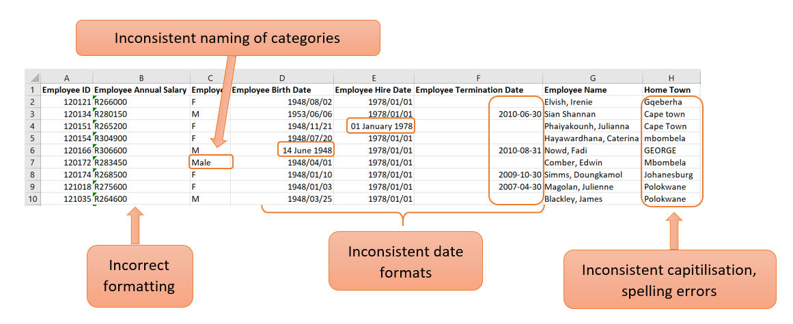
```

### Correct the formatting of a cell {.unnumbered .unlisted}

In the example above, the values in the "Employee Annual Salary" column are seen as text. This is clearly visible with the left alignment of the values in the cell. Because annual salary is a numerical value, the formatting needs to be corrected so that Excel can handle the values as numbers.

This can be corrected with the following steps:

1.  If you click in the cell, there will be a yellow block with an exclamation mark on the left.

```{r, echo = FALSE, out.width='40%',fig.align='center'}
knitr::include_graphics("Figures/cleaning_formatting_1.png")
```

2. By clicking on the warning sign, a dropdown list will open where you can choose the option “Convert to Number”. 

```{r, echo = FALSE, out.width='40%',fig.align='center'}
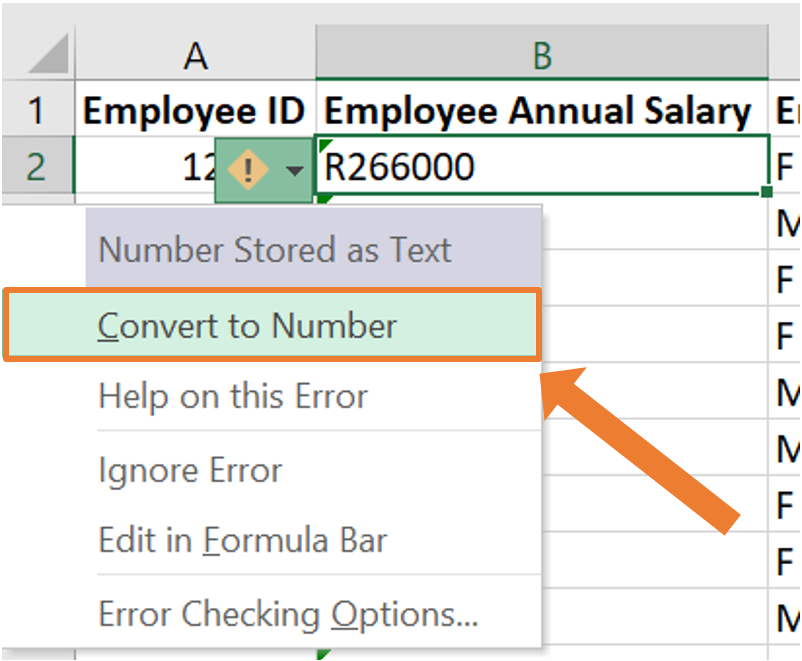
```

3.  Now the cell's formatting will be corrected. This can be seen by the value being right aligned within the cell. 

```{r, echo = FALSE, out.width='40%',fig.align='center'}
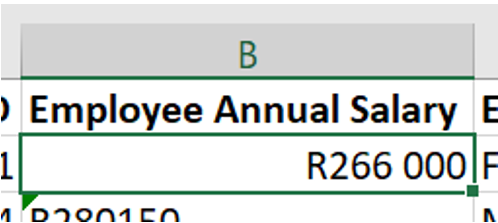
```

4. To do this for an entire column, The same procedure can be followed by highlighting all the cells that need to be changed.

This process will automatically change the format of the cells from text to “currency”. If you work with this data set in Excel, this formatting will be sufficient as Excel knows how to work with this. If the data set is imported into another statistical program (which you will be familiarised later on), the format of this column needs to be “Number” instead of “Currency”. 

This can be done by navigating to the “Number” group on the Home tab in Excel and opening the dropdown list. From this dropdown list, the appropriate formatting can be selected which is "Number" in this case.

```{r, echo = FALSE, out.width='40%',fig.align='center'}
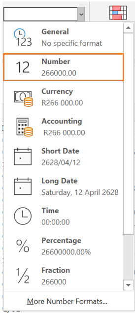
```


### Inconsistent naming of categories {.unnumbered .unlisted}

In column C of the example above, the categories are not named consistently. This column consists of the gender of each employee. By glancing at the screenshot of the first few lines of the data, it can be seen that the categories are labelled as "M" (for male) and "F" (for female). However, in line 7, the entry is "Male". There can be more occurrences like this further in the data. Having inconsistent naming of categories is not ideal as this will cause problems when you start to work with the data. For example, when constructing frequency tables or barplots. 

This can be corrected with the following steps:

1. Select all the columns of the data set. In the "Editing" group on the "Home" tab, click on "Sort & Filter" and then on "Filter. This will allow you to filter the data by a specific column.

```{r, echo = FALSE, out.width='70%',fig.align='center'}
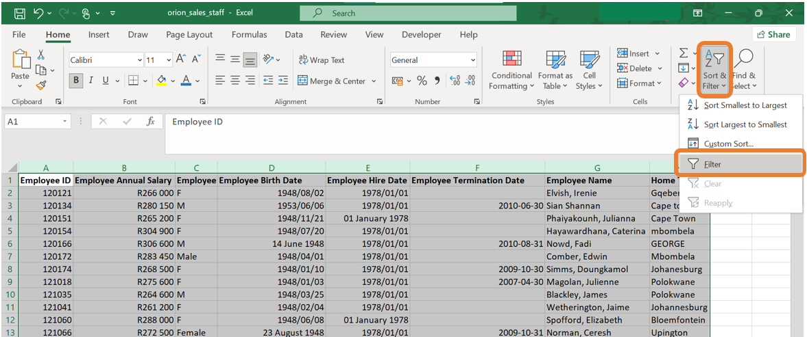
```

2. The filter icon will now be next to each column name. When clicking on the item next to the column name you would like to filter on, a menu will open up. On this menu, you have the ability to sort the data by this column or filter certain categories. In the screenshot below, all the categories are ticked meaning that all the observations of the data set will be displayed. In the example below, it can be seen that there are categories named "M", "F", "Male" and "Female". We would like to change all the observations with category "Female" to "F" and all the observations with category "Male" to "M".

```{r, echo = FALSE, out.width='40%',fig.align='center'}
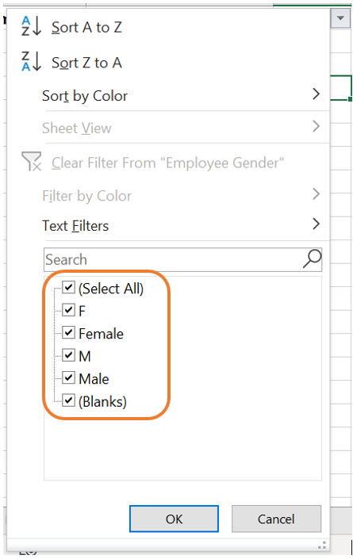
```

3. When removing the tick marks of all the categories except one, only the observations from the specific category will be displayed. In our case, let us first filter all the observations where the gender is indicated as "Female".

```{r, echo = FALSE, out.width='70%',fig.align='center'}
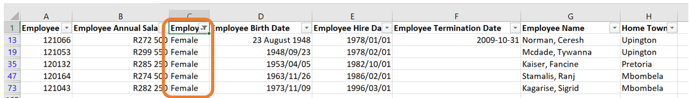
```

4. Having all the observations filtered out, you can manually change the categories to "F".

```{r, echo = FALSE, out.width='70%',fig.align='center'}
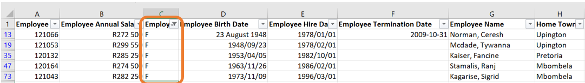
```

5. The came can be done for the males. Again, click on the filter icon next to the column name. Remove the tick marks of all the categories except the one with "Male".

```{r, echo = FALSE, out.width='70%',fig.align='center'}
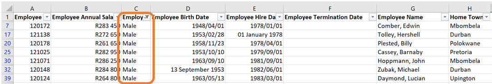
```

6. Then, manually change the categories to "M". 

```{r, echo = FALSE, out.width='70%',fig.align='center'}
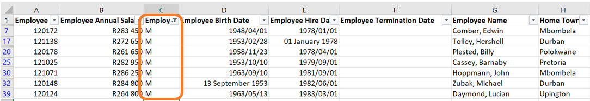
```

### Inconsistent capitalisations {.unnumbered .unlisted}

In the column named "Home Town", there are a few observations where the name of the town is written in all capital letters, all small letters or the second word is written with a small letter instead of a capital letter. 

The best and quickest way to correct this is to create a new column and use built-in Excel functions to do the correction. Let us call this column "Home Town cleaned". 

Next, we will introduce three new functions that will alter how the names of the towns are written. 

1. The first function is `=UPPER()`. This function will return the word in the selected cell written in all capital letters. 

```{r, echo = FALSE, out.width='40%',fig.align='center'}
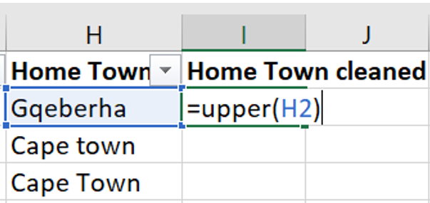
```

```{r, echo = FALSE, out.width='40%',fig.align='center'}
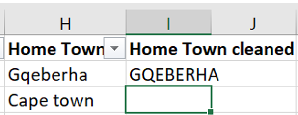
```

2. The second function is `=LOWER()`. This function will return the word in the selected cell written in all lower case letters. 

```{r, echo = FALSE, out.width='40%',fig.align='center'}
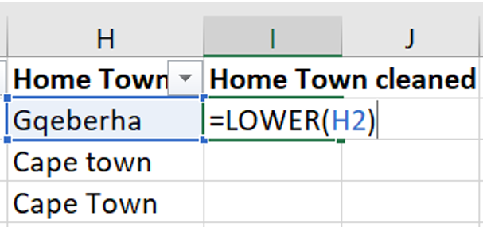
```

```{r, echo = FALSE, out.width='40%',fig.align='center'}
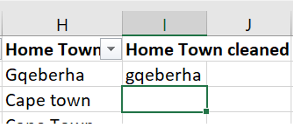
```

3. The third function is `=PROPER()`. This function will return the word in the selected cell where the first letter of each word is written in a capital letter followed by lower case letters. 

```{r, echo = FALSE, out.width='40%',fig.align='center'}
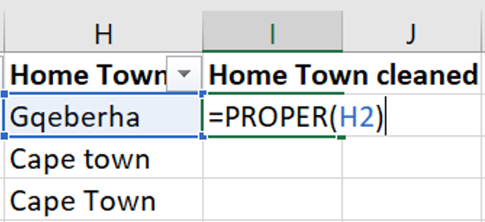
```

```{r, echo = FALSE, out.width='40%',fig.align='center'}
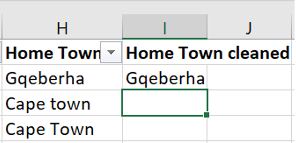
```

In the same column, some of the town names are misspelled. This can be corrected similarly to how you corrected the inconsistencies in the category names. 

### Correcting the date format {.unnumbered .unlisted}

The columns "Employee Birth Date", "Employee Hire Date" and "Employee Termination Date" are examples of columns containing dates. 

The dates can be corrected by selecting all the columns containing dates, then selecting the "short date" format on the drop-down list in the "Number" group on the "Home tab.

```{r, echo = FALSE, out.width='40%',fig.align='center'}
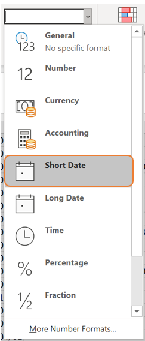
```

## Exercises {.unnumbered .unlisted}

1. Explain why data cleaning is an essential step for the analysis.

2. List some data cleaning techniques and provide an example of where such technique might be necessary.

3. Name the functions in Excel that can be used to change the capitilisation of words in Excel.
