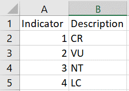
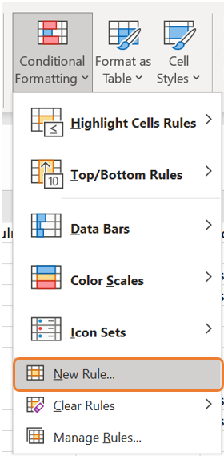
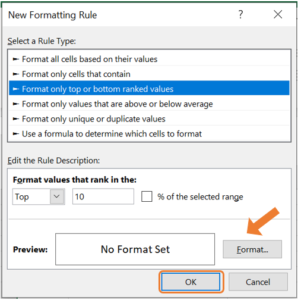
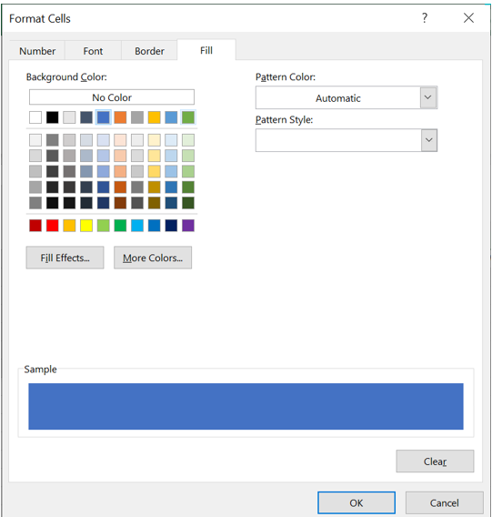

# Data manipulation

Data manipulation is the process of adjusting data so that it is easier to work with and more organised. Data manipulation is a crucial part of the analytical process because it allows statisticians to prepare data in a format that meets the requirements of specific analyses. The specific data manipulation needs depends on the application at hand as well as the statistical analysis that is required. Proper data manipulation enhances the interpretability of data, ensures accuracy in computations, and enables the effective application of statistical methods. Without it, raw data might obscure patterns, relationships, and insights that are vital for informed decision-making.

Data manipulation may include the following:

- Removing the data that is not necessary for your analysis.

- Identifying and removing rows that are duplicated.

- Encoding categorical data either to or from a numerical format.

- Conditional formatting in Excel.

- Combining data sets.

- Splitting and combining columns. 

- Pivot tables in Excel to reshape the data set.

## Example: Super Animals {.unlisted}

A few years ago, the Super Animal Cards were available at Pick n Pay stores. These collectible cards feature illustrations and fascinating facts about various animals. The aim was to spark curiosity and environmental awareness among children. Each card highlights a different animal's unique characteristics, habitat and conservation status. 

[ADD PICTURES]

```{r echo = FALSE, warning = FALSE, message=FALSE}
library(knitr)
```


```{r echo=FALSE, out.width="20%", fig.show='hold', fig.align='center'}
include_graphics(c("Figures/super-animals.png","Figures/super-animals2.png"))
```


The information from these cards are collected in a data set called `super-animals.xlsx`.

### The VLOOKUP function {.unnumbered .unlisted}

The VLOOKUP function in Excel is a powerful tool to make data more descriptive and meaningful by referencing values from another table. In this example, the conservation status of animals is initially indicated with numeric values (1, 2, 3, and 4) in the dataset. To make this information more interpretable, we use a lookup table containing the corresponding descriptions for each number:

```{r echo = FALSE, results='asis', warning = FALSE, message = FALSE}
library(kableExtra)

cons <- data.frame(Indicator = c(1,2,3,4),
                   Description = c("Critically Endangered (CR)", "Vulnerable (VU)", "Near Threatened (NT)", "Least Concern (LC)"))

cons %>%
  kbl() %>%
  kable_classic(full_width = F)
```

By replicating the lookup table in a separate sheet of the Excel file, the VLOOKUP function can map the numeric indicators to their corresponding descriptions. This method not only improves clarity but also allows for easier data analysis and reporting, making it a practical approach to handle coded information in datasets.

The syntax for the VLOOKUP function is:

`=VLOOKUP(lookup_value, table_array, col_index_num, [range_lookup])`

- `lookup_value`: The value you want to search for in the first column of the table.

- `table_array`: The range of cells containing the table, including the column with the lookup value and the column with the return value.

- `col_index_num`: The column number (relative to the table) from which to retrieve the result.

- `range_lookup (optional)`: Specifies whether the match should be exact (`FALSE`) or approximate (`TRUE`). By default, it's approximate.

In this example, the process of using the VLOOKUP function to map descriptive conservation statuses to numeric indicators involves the following steps:

1. Begin by entering the lookup table in a separate sheet within the Excel file. This table should contain the numeric indicators in one column and their corresponding descriptions in another.

```{r echo=FALSE, out.width="30%", fig.align='center'}

```

2. In a new column of your dataset, type the VLOOKUP formula to reference the lookup table. Ensure you use absolute cell references (with dollar signs, e.g., `$A$1:$B$5`) for the lookup table range. This prevents the table reference from shifting when you drag the formula down to apply it to other rows.

```{r echo=FALSE, out.width="70%", fig.align='center'}
include_graphics("Figures/manipulation_1_formula.png")
```

### Conditional formatting {.unnumbered .unlisted}

Conditional formatting is a tool in Excel that allows users to automatically apply formatting to certain cells based on specified criteria. The formatting can be colours, icons, or many others. You can create rules based on predefined options or custom formulas. 

In the example of the Super Animal Cards, conditional formatting can be used to highlight the top 10 animals with the highest weights. This is particularly useful for quickly identifying the heaviest animals in the data set. To achieve this in Excel:

1. Select the column containing the weight data.

```{r, echo=FALSE, out.width='70%', fig.align='center'}
include_graphics("Figures/manipulation_2_1.png")
```


2. Navigate to the **Home** tab, click on **Conditional Formatting** and choose **New Rule**.

```{r, echo=FALSE, out.width='30%', fig.align='center'}

```

3. In the New Formatting Rule dialog box, select **Format only top or bottom ranked values**. This allows you to target the top 10 entries in the dataset.

```{r, echo=FALSE, out.width='40%', fig.align='center'}

```

4. Specify the formatting style, such as a bold font or a shaded cell color, to visually emphasise the top 10 entries.

```{r, echo=FALSE, out.width='40%', fig.align='center'}

```


### Numerical calculations in Excel {.unnumbered .unlisted}

Excel can also perform basic numerical calculations, such as addition, subtraction, multiplication, and division. These operations can be executed directly in cells using simple formulas:

- Addition: `=A1 + B1` adds the values in cells A1 and B1.

- Subtraction: `=A1 - B1` subtracts the value in cells B1 from A1.

- Multiplication: `=A1 * B1` multiplies the values in cells A1 and B1.

- Division: `=A1 / B1` divides the value in cell A1 by the value in cell B1.

These formulas can also combine multiple operations using parentheses for clarity and order of precedence. For example, `=(A1 + B1) * C1` first adds the values in cells A1 and B1, then multiplies the result by the value in cell C1.

In the example of the Super Animal Cards, we can convert the speed from kilometers per hour to miles per hour by multiplying the values in column H with 0.621371.

```{r, echo=FALSE, out.width='70%', fig.align='center'}
include_graphics("Figures/manipulation_3_1.png")
```


## Example: Orion sales {.unlisted}

### Combining data sets {.unnumbered .unlisted}

### Splitting columns {.unnumbered .unlisted}

### Combining columns {.unnumbered .unlisted}


